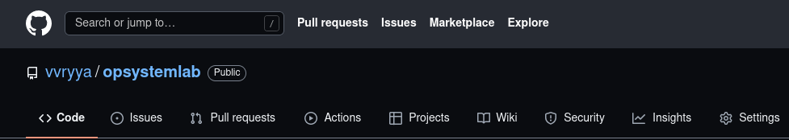
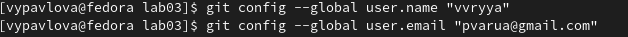
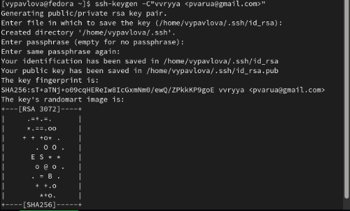
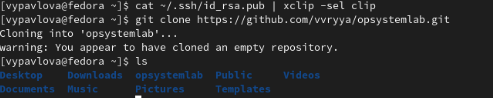
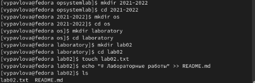
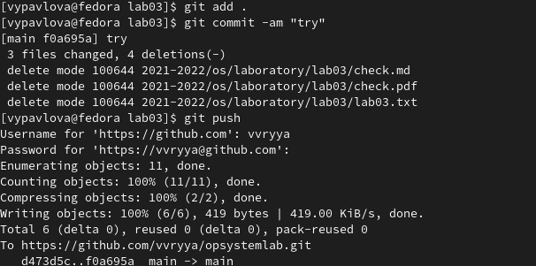
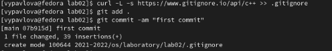

---
## Front matter
title: "Отчет по лабораторной работе"
subtitle: "Лабораторная работа №2"
author: "Павлова Варвара Юрьевна НПМбд-02-21"

## Generic otions
lang: ru-RU
toc-title: "Содержание"

## Bibliography
bibliography: bib/cite.bib
csl: pandoc/csl/gost-r-7-0-5-2008-numeric.csl

## Pdf output format
toc: true # Table of contents
toc-depth: 2
lof: true # List of figures
lot: true # List of tables
fontsize: 12pt
linestretch: 1.5
papersize: a4
documentclass: scrreprt
## I18n polyglossia
polyglossia-lang:
  name: russian
  options:
	- spelling=modern
	- babelshorthands=true
polyglossia-otherlangs:
  name: english
## I18n babel
babel-lang: russian
babel-otherlangs: english
## Fonts
mainfont: PT Serif
romanfont: PT Serif
sansfont: PT Sans
monofont: PT Mono
mainfontoptions: Ligatures=TeX
romanfontoptions: Ligatures=TeX
sansfontoptions: Ligatures=TeX,Scale=MatchLowercase
monofontoptions: Scale=MatchLowercase,Scale=0.9
## Biblatex
biblatex: true
biblio-style: "gost-numeric"
biblatexoptions:
  - parentracker=true
  - backend=biber
  - hyperref=auto
  - language=auto
  - autolang=other*
  - citestyle=gost-numeric
## Pandoc-crossref LaTeX customization
figureTitle: "Рис."
tableTitle: "Таблица"
listingTitle: "Листинг"
lofTitle: "Список иллюстраций"
lotTitle: "Список таблиц"
lolTitle: "Листинги"
## Misc options
indent: true
header-includes:
  - \usepackage{indentfirst}
  - \usepackage{float} # keep figures where there are in the text
  - \floatplacement{figure}{H} # keep figures where there are in the text
---

# Цель работы

Изучение идеологии и применения средства контроля версий, освоение умений по работе с git.

# Задание

Установить и настроить систему контроля версий Git. 

# Теоретическое введение

Система контроля версий Git представляет собой набор программ командной строки. Доступ к ним можно получить из терминала посредством ввода команды git с различными опциями.
Благодаря тому, что Git является распределенной системой контроля версий, резервную копию локального хранилища можно сделать простым копированием или архивацией.

Например, в табл. [-@tbl:std-dir] приведено краткое описание основных команд git.

: Описание некоторых каталогов файловой системы GNU Linux {#tbl:std-dir}

| Имя каталога | Описание каталога                                                                                                          |
|--------------|----------------------------------------------------------------------------------------------------------------------------|
| `git init`          |  создание основного дерева репозитория                      |
| `git pull `      | получение обновлений(изменений) текущего дерева из центрального репозитория    |
| `git status`       |  просмотр списка изменённых файлов втекущей директории                                |
| `git push`      | отправка всех произведённых изменений локального дерева в центральный репози-
торий |
| `git diff`     | просмотр текущих изменений носителей                                                                                   |
                                                                         |

# Выполнение лабораторной работы

1. Создаем учетную запись на https://github.com. Учетная запись называется vvryya. (рис. -@fig:001)

 { #fig:001 width=70% }

2. Настраиваем систему контроля версий git. Синхронизируем учетную запись с компьютером. (рис. -@fig:002) Создаем ssh-ключ на github. (рис. -@fig:003)

 { #fig:002 width=70% } 

 { #fig:003 width=70% }

3. Привязываем ключ к компьютеру через консоль и подключаем репозиторий opsystem к компьютеру. (рис. -@fig:004)

 { #fig:004 width=70% }

4. Переходим в папку репозитория и создаем в ней новые папки, как указано в задании к лабораторной. В папке lab02 создаем файлы README.md и lab02.txt. (рис. -@fig:005)

 { #fig:005 width=70%}

5. Добавляем данный коммит на github. Для того, чтобы его разместить используем команду *git add .*, с помощью команды *git commit -am "some text"* выкладываем коммит. Сохраняем коммит, используя команду *git push*. (рис. -@fig:006)

 { #fig:006 width=70% }

6. Скачиваем список шаблонов и выбираем один из них и также скачиваем в файл .gitignore. Публикуем данный коммит на github. (рис. -@fig:007)

 { #fig:007 width=70% }

# Выводы

Выполняя данную работу я ознакомилась с системой контроля версий git и научилась ей пользоваться.

# Список литературы{.unnumbered}

::: {#refs}
:::
