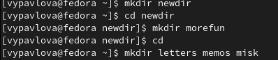
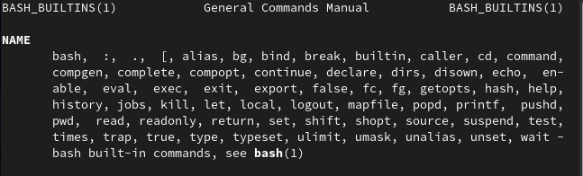

---
## Front matter
title: "Отчет"
subtitle: "Лабораторная работа №4"
author: "Павлова Варвара Юрьевна 1032217616 НПМбд-02-21"

## Generic otions
lang: ru-RU
toc-title: "Содержание"

## Bibliography
bibliography: bib/cite.bib
csl: pandoc/csl/gost-r-7-0-5-2008-numeric.csl

## Pdf output format
toc: true # Table of contents
toc-depth: 2
lof: true # List of figures
lot: true # List of tables
fontsize: 12pt
linestretch: 1.5
papersize: a4
documentclass: scrreprt
## I18n polyglossia
polyglossia-lang:
  name: russian
  options:
	- spelling=modern
	- babelshorthands=true
polyglossia-otherlangs:
  name: english
## I18n babel
babel-lang: russian
babel-otherlangs: english
## Fonts
mainfont: PT Serif
romanfont: PT Serif
sansfont: PT Sans
monofont: PT Mono
mainfontoptions: Ligatures=TeX
romanfontoptions: Ligatures=TeX
sansfontoptions: Ligatures=TeX,Scale=MatchLowercase
monofontoptions: Scale=MatchLowercase,Scale=0.9
## Biblatex
biblatex: true
biblio-style: "gost-numeric"
biblatexoptions:
  - parentracker=true
  - backend=biber
  - hyperref=auto
  - language=auto
  - autolang=other*
  - citestyle=gost-numeric
## Pandoc-crossref LaTeX customization
figureTitle: "Рис."
tableTitle: "Таблица"
listingTitle: "Листинг"
lofTitle: "Список иллюстраций"
lotTitle: "Список таблиц"
lolTitle: "Листинги"
## Misc options
indent: true
header-includes:
  - \usepackage{indentfirst}
  - \usepackage{float} # keep figures where there are in the text
  - \floatplacement{figure}{H} # keep figures where there are in the text
---

# Цель работы

Приобретение практических навыков взаимодействия пользователя с системой посредством командной строки.

# Задание

1. Определите полное имя вашего домашнего каталога. Далее относительно этого ката-
лога будут выполняться последующие упражнения.
2. Выполните следующие действия:
1. Перейдите в каталог /tmp.
2. Выведите на экран содержимое каталога /tmp. Для этого используйте команду ls
с различными опциями. Поясните разницу в выводимой на экран информации.
3. Определите, есть ли в каталоге /var/spool подкаталог с именем cron?
4. Перейдите в Ваш домашний каталог и выведите на экран его содержимое. Опре-
делите, кто является владельцем файлов и подкаталогов?
3. Выполните следующие действия:
1. В домашнем каталоге создайте новый каталог с именем newdir.
2. В каталоге ~/newdir создайте новый каталог с именем morefun.
3. В домашнем каталоге создайте одной командой три новых каталога с именами
letters, memos, misk. Затем удалите эти каталоги одной командой.
4. Попробуйте удалить ранее созданный каталог ~/newdir командой rm. Проверьте,
был ли каталог удалён.
5. Удалите каталог ~/newdir/morefun из домашнего каталога. Проверьте, был ли
каталог удалён.
4. С помощью команды man определите, какую опцию команды ls нужно использо-
вать для просмотра содержимое не только указанного каталога, но и подкаталогов,
входящих в него.
5. С помощью команды man определите набор опций команды ls, позволяющий отсорти-
ровать по времени последнего изменения выводимый список содержимого каталога
с развёрнутым описанием файлов.
6. Используйте команду man для просмотра описания следующих команд: cd, pwd, mkdir,
rmdir, rm. Поясните основные опции этих команд.
7. Используя информацию, полученную при помощи команды history, выполните мо-
дификацию и исполнение нескольких команд из буфера команд.
# Теоретическое введение

В операционной системе типа Linux взаимодействие пользователя с системой обычно
осуществляется с помощью командной строки посредством построчного ввода ко-
манд. При этом обычно используется командные интерпретаторы языка shell: /bin/sh;
/bin/csh; /bin/ksh.
**Формат команды.** Командой в операционной системе называется записанный по
специальным правилам текст (возможно с аргументами), представляющий собой ука-
зание на выполнение какой-либо функций (или действий) в операционной системе.
Обычно первым словом идёт имя команды, остальной текст — аргументы или опции,
конкретизирующие действие.
Общий формат команд можно представить следующим образом:
*<имя_команды><разделитель><аргументы>*

# Выполнение лабораторной работы

1. Определяю полное имя своего домашнего каталога с помощью команды pwd. (рис. [-@fig:001])

{ #fig:001 width=70% }

2. Перехожу в каталог tmp и вывожу на экран его содержимое. (рис. [-@fig:002]) Определяю, есть ли в каталоге /var/spool подкаталог с именем cron. Его нет. (рис. [-@fig:003]) Перехожу в домашний каталог, вывожу на экран его содержимое и указываю владельцев файлов. (рис. [-@fig:004])

{ #fig:002 width=70% }

{ #fig:003 width=70% }

{ #fig:004 width=70% }

3. В домашнем каталоге создаю новый каталог с именем newdir. В каталоге ~/newdir создаю подкаталог morefun, перехожу в домашний каталог и создаю в нем одной командой три каталога letters, memos и misk. (рис. [-@fig:005]) Далее одной командой удаляю все эти три каталога и проверяю с помощью команды ls. (рис. [-@fig:006]) Пробую удалить каталог ~/newdir командой rm и проверяю, был ли он удаен командой ls. (рис. [-@fig:007]) Командой rm -r пробую удалить каталог ~/newdir/morefun. (рис. [-@fig:008])

{ #fig:005 width=70% }

{ #fig:006 width=70% }

{ #fig:007 width=70% }

{ #fig:008 width=70% }

4. С помощью команды man ls (рис. [-@fig:009]) определяю, что для просмотра содержимого не только указанного каталога, но и подкаталогов, входящих в него, нужно использовать опцию -R. (рис. [-@fig:010])

{ #fig:009 width=70% }

{ #fig:010 width=70% }

5. С помощью команды man ls определяю набор опций, позволяющий отсортировать по времени последнего изменения выводимый список содержимого каталога с развернутым описанием файлов.(рис. [-@fig:011])

{ #fig:011 width=70% }

6. Использую команду man для просмотра описания команд cd (рис. [-@fig:012]), pwd (рис. [-@fig:013]), mkdir (рис. [-@fig:014]), rmdir (рис. [-@fig:015]), rm (рис. [-@fig:016]).

{ #fig:012 width=70% }

{ #fig:013 width=70% }

{ #fig:014 width=70% }

{ #fig:015 width=70% }

{ #fig:016 width=70% }

7. Используя информацию, полученную при помощи команды history  (рис. [-@fig:017]), выполняю модификацию и исполнение нескольких команд из буфера команд. (рис. [-@fig:018])

{ #fig:017 width=70% }

{ #fig:018 width=70% }

# Выводы

Выполняя данную лабораторную работу, я освоила команды для работы с системой.

# Список литературы{.unnumbered}

::: {#refs}
:::
