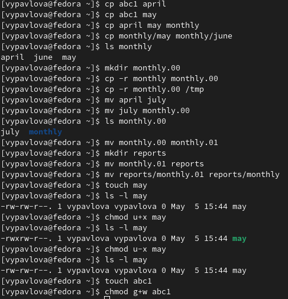
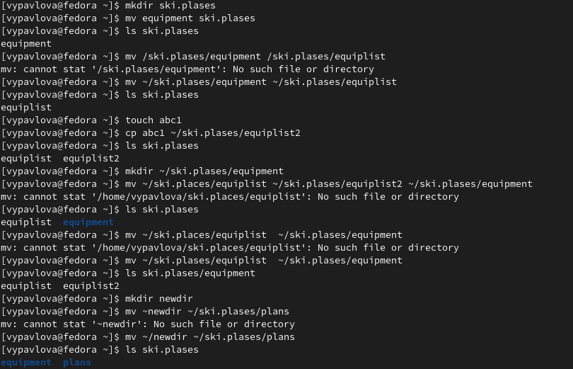
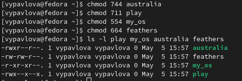
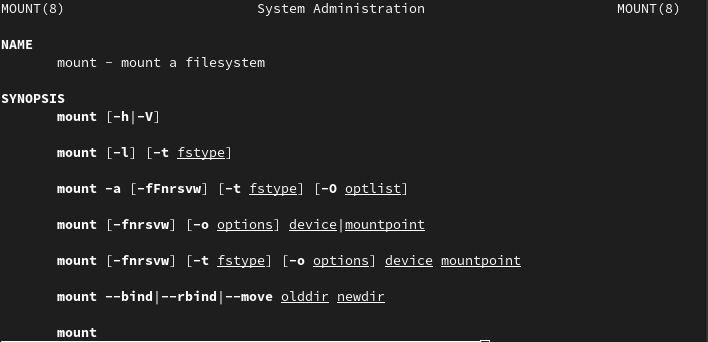
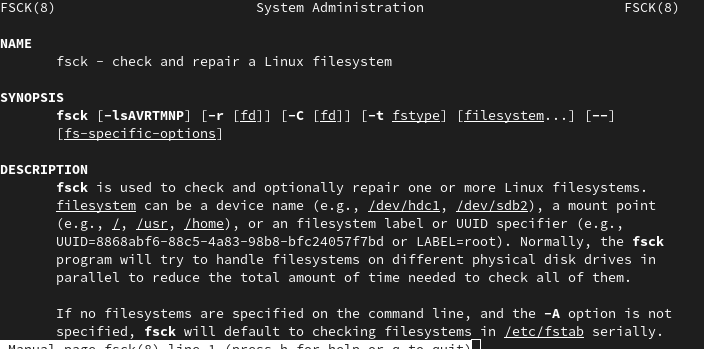
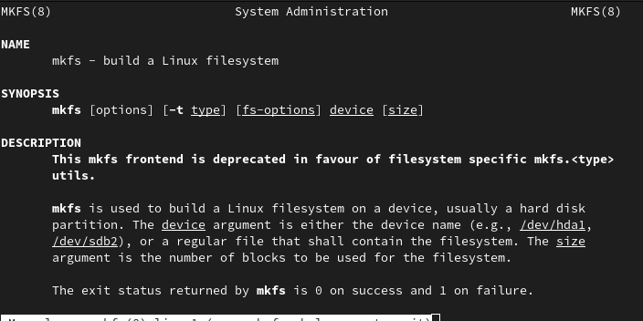
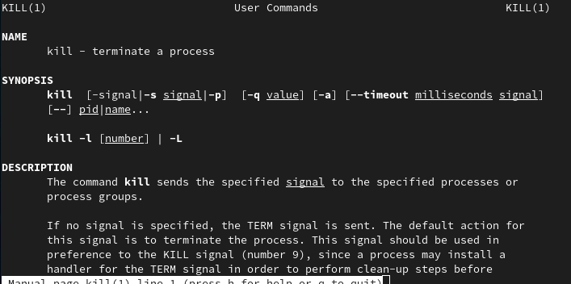

---
## Front matter
lang: ru-RU
title: Лабораторная работа №5
author: |
	Павлова Варвара Юрьевна НПМбд-02-21
institute: |
	Российский Университет Дружбы Народов

## Formatting
toc: false
slide_level: 2
theme: metropolis
header-includes: 
 - \metroset{progressbar=frametitle,sectionpage=progressbar,numbering=fraction}
 - '\makeatletter'
 - '\beamer@ignorenonframefalse'
 - '\makeatother'
aspectratio: 43
section-titles: true
---

## Цель работы
Ознакомление с файловой системой Linux, ее структурой, именами и содержанием
каталогов. Приобретение практических навыков по применению команд для работы
с файлами и каталогами, обслуживания файловой системы.

# Ход работы

## Выполняю все примеры, приведенные в первой части описания лабораторной работы. 

(рис. [-@fig:001])

{#fig:001 width = 70%)

## Выполняю все действия, указанные во 2 пункте задания.

(рис. [-@fig:002])

{#fig:002 width = 70%)

## Определяю опции команды chmod,необходимые для того,чтобы присвоить перечисленным ниже файлам выделенные права доступа.

(рис. [-@fig:003])

{#fig:003 width = 70%)

## Проделываю упражнения, указанные в пункте 4 задания.

(рис. [-@fig:004])

{#fig:004 width = 70%)

# Читаю man mount

(рис. [-@fig:005])

{#fig:005 width = 70%)

# Читаю man fsck

(рис. [-@fig:006])

{#fig:006 width = 70%)

# Читаю man mkfs

(рис. [-@fig:007])

{#fig:007 width = 70%)

# Читаю man kill 

(рис. [-@fig:008])

{#fig:008 width = 70%)

## Вывод

Выполняя данную лабораторную работу я ознакомилась с файловой системой Linux и научилась с ней взаимодействовать.

