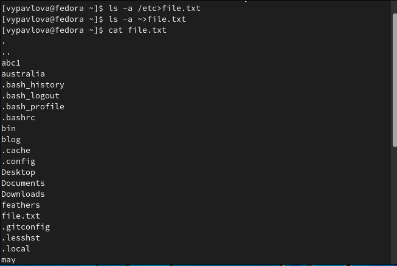
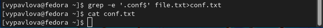
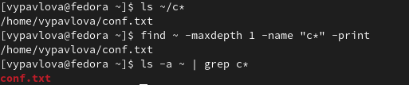
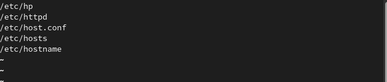
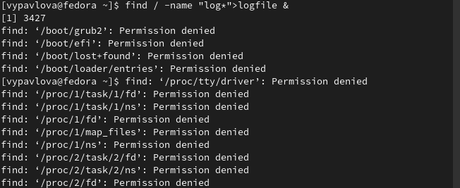
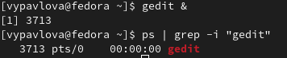
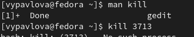
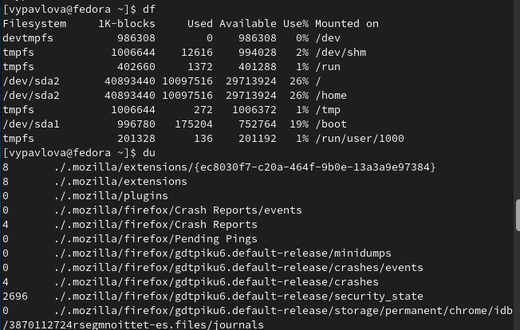
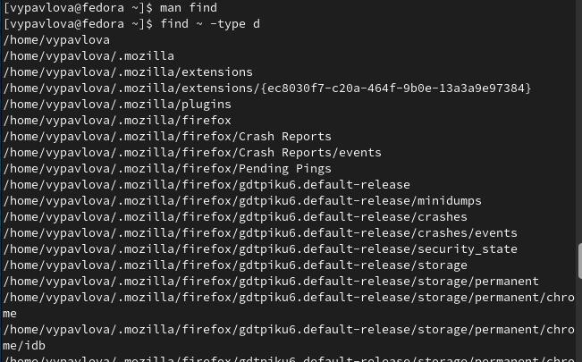

---
## Front matter
lang: ru-RU
title: Презентация по лабораторной работе №5
author: |
	Павлова Варвара Юрьевна НПМбд-02-21
institute: |
	Российский Университет Дружбы Народов

## Formatting
toc: false
slide_level: 2
theme: metropolis
header-includes: 
 - '\makeatletter'
 - '\makeatother'
aspectratio: 43
section-titles: true
---

# Цель работы

Ознакомление с инструментами поиска файлов и фильтрации текстовых данных.
Приобретение практических навыков: по управлению процессами (и заданиями), по
проверке использования диска и обслуживанию файловых систем.

# Ход работы

## Первый пункт

Осуществляю вход в систему,используя соответствующее имя пользователя.

## Второй пункт

Записываю в файл file.txt названия файлов,содержащихся в каталоге /etc. Дописываю в этот же файл названия файлов,содержащихся в вашем домашнем каталоге. (рис. [-@fig:001])

{ #fig:001 width=70% }

## Третий пункт

Вывожу имена всех файлов из file.txt,имеющих расширение .conf,после чего
записываю их в новый текстовой файл conf.txt.(рис. [-@fig:002])

{ #fig:002 width=70% } 

## Четвертый пункт

Определяю,какие файлы в вашем домашнем каталоге имеют имена,начинавшиеся
с символа c. (рис. [-@fig:003])

{ #fig:003 width=70% } 

## Пятый пункт

Вывожу на экран (по странично) имена файлов из каталога /etc,начинающиеся
с символа h. (рис. [-@fig:004])

{ #fig:004 width=70% } 

## Шестой пункт

Запускаю в фоновом режиме процесс,который будетзаписывать в файл ~/logfile
файлы,имена которых начинаются с log.(рис. [-@fig:005])

{ #fig:005 width=70% }

## Седьмой пункт

Удаляю файл ~/logfile.(рис. [-@fig:006]) 

{ #fig:006 width=70% }

## Восьмой пункт

Запускаю из консоли в фоновом режиме редактор gedit. Определяю идентификатор процесса gedit,используя команду ps,конвейер и фильтр grep.(рис. [-@fig:007]) 

{ #fig:007 width=70% }

## Девятый пункт

Читаю  справку (man) команды kill, после чего использую её для завершения
процесса gedit.  (рис. [-@fig:008])

{ #fig:008 width=70% }
 
## Десятый пункт

Выполняю команды df и du,предварительно получив более подробную информацию
об этих командах,с помощью команды man. (рис. [-@fig:009])

{ #fig:009 width=70% }

## Одиннадцатый пункт

Воспользовавшись справкой команды find, вывожу имена всех директорий,имею-
щихся в домашнем каталоге.  (рис. [-@fig:010]) 

{ #fig:010 width=70% }

# Выводы

Выполняя данную лабораторную работу я ознакомилась с инструментами поиска файлов и фильтрации текстовых данных и приобрела практические навыки по управлению процессами, проверке использования диска и обслуживанию файловых систем.

