---
## Front matter
title: "Отчет"
subtitle: "Лабораторная работа №6"
author: "Павлова Варвара Юрьевна НПМбд-02-21"

## Generic otions
lang: ru-RU
toc-title: "Содержание"

## Bibliography
bibliography: bib/cite.bib
csl: pandoc/csl/gost-r-7-0-5-2008-numeric.csl

## Pdf output format
toc: true # Table of contents
toc-depth: 2
lof: true # List of figures
lot: true # List of tables
fontsize: 12pt
linestretch: 1.5
papersize: a4
documentclass: scrreprt
## I18n polyglossia
polyglossia-lang:
  name: russian
  options:
	- spelling=modern
	- babelshorthands=true
polyglossia-otherlangs:
  name: english
## I18n babel
babel-lang: russian
babel-otherlangs: english
## Fonts
mainfont: PT Serif
romanfont: PT Serif
sansfont: PT Sans
monofont: PT Mono
mainfontoptions: Ligatures=TeX
romanfontoptions: Ligatures=TeX
sansfontoptions: Ligatures=TeX,Scale=MatchLowercase
monofontoptions: Scale=MatchLowercase,Scale=0.9
## Biblatex
biblatex: true
biblio-style: "gost-numeric"
biblatexoptions:
  - parentracker=true
  - backend=biber
  - hyperref=auto
  - language=auto
  - autolang=other*
  - citestyle=gost-numeric
## Pandoc-crossref LaTeX customization
figureTitle: "Рис."
tableTitle: "Таблица"
listingTitle: "Листинг"
lofTitle: "Список иллюстраций"
lotTitle: "Список таблиц"
lolTitle: "Листинги"
## Misc options
indent: true
header-includes:
  - \usepackage{indentfirst}
  - \usepackage{float} # keep figures where there are in the text
  - \floatplacement{figure}{H} # keep figures where there are in the text
---

# Цель работы

Ознакомление с инструментами поиска файлов и фильтрации текстовых данных.
Приобретение практических навыков: по управлению процессами (и заданиями), по
проверке использования диска и обслуживанию файловых систем.

# Задание

1. Осуществите вход в систему,используя соответствующее имя пользователя.
2. Запишите в файл file.txt названия файлов,содержащихся в каталоге /etc.Допи-
шите в этот же файл названия файлов,содержащихся в вашем домашнем каталоге.
3. Выведите имена всех файлов из file.txt,имеющих расширение .conf,после чего
запишите их в новыйтекстовой файл conf.txt.
4. Определите,какие файлы в вашем домашнем каталоге имеют имена,начинавшиеся
с символа c? Предложите несколько вариантов,как это сделать.
5. Выведите на экран (по странично) имена файлов из каталога /etc,начинающиеся
с символа h.
6. Запустите в фоновом режиме процесс,который будетзаписывать в файл ~/logfile
файлы,имена которых начинаются с log.
7. Удалите файл ~/logfile.
8. Запустите из консоли в фоновом режиме редактор gedit.
9. Определитеидентификаторпроцессаgedit,используякомандуps,конвейерифильтр
grep.Как ещё можно определить идентификатор процесса?
10. Прочтите справку (man) команды kill, после чего используйте её для завершения
процесса gedit.
11. Выполните команды df и du,предварительно получив более подробную информацию
об этих командах,с помощью команды man.
12. Воспользовавшись справкой команды find,выведите имена всех директорий,имею-
щихся в вашем домашнем каталоге

# Выполнение лабораторной работы

1. Осуществляю вход в систему,используя соответствующее имя пользователя.
2. Записываю в файл file.txt названия файлов,содержащихся в каталоге /etc. Дописываю в этот же файл названия файлов,содержащихся в вашем домашнем каталоге. (рис. [-@fig:001])

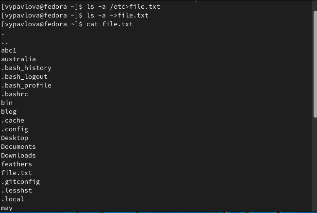{ #fig:001 width=70% }

3. Вывожу имена всех файлов из file.txt,имеющих расширение .conf,после чего
записываю их в новый текстовой файл conf.txt.(рис. [-@fig:002])

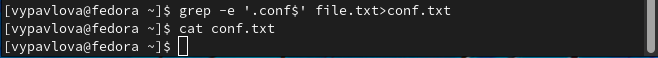{ #fig:002 width=70% } 

4. Определяю,какие файлы в вашем домашнем каталоге имеют имена,начинавшиеся
с символа c. (рис. [-@fig:003])

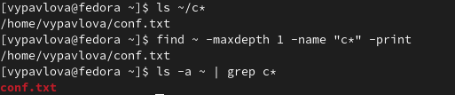{ #fig:003 width=70% } 

5. Вывожу на экран (по странично) имена файлов из каталога /etc,начинающиеся
с символа h. (рис. [-@fig:004]) (рис. [-@fig:005])

{ #fig:004 width=70% } 

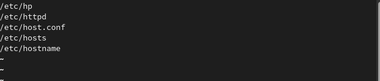{ #fig:005 width=70% } 

6. Запускаю в фоновом режиме процесс,который будетзаписывать в файл ~/logfile
файлы,имена которых начинаются с log.(рис. [-@fig:006]) (рис. [-@fig:007]) 

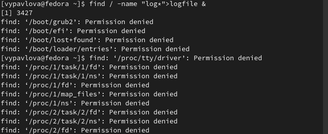{ #fig:006 width=70% }

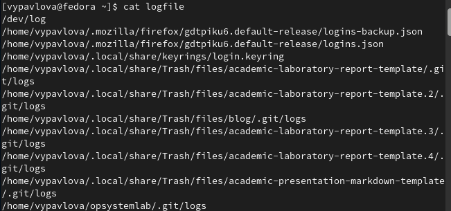{ #fig:007 width=70% } 

7. Удаляю файл ~/logfile.(рис. [-@fig:008]) 

{ #fig:008 width=70% }

8. Запускаю из консоли в фоновом режиме редактор gedit. Определяю идентификатор процесса gedit,используя команду ps,конвейер и фильтр grep.(рис. [-@fig:009]) 

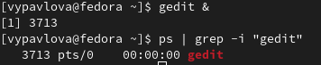{ #fig:009 width=70% }

9. Читаю  справку (man) команды kill(рис. [-@fig:010]), после чего использую её для завершения
процесса gedit.  (рис. [-@fig:011]) 

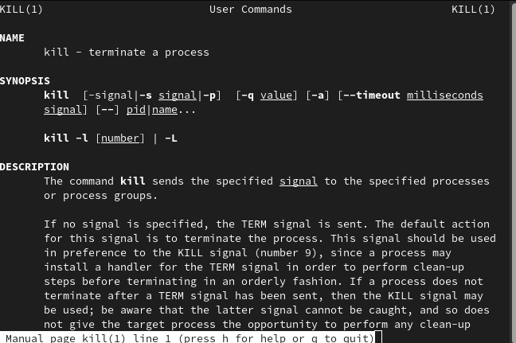{ #fig:010 width=70% }

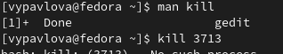{ #fig:011 width=70% }

10. Выполняю команды df и du,предварительно получив более подробную информацию
об этих командах,с помощью команды man. (рис. [-@fig:012]) (рис. [-@fig:013]) (рис. [-@fig:014]) 

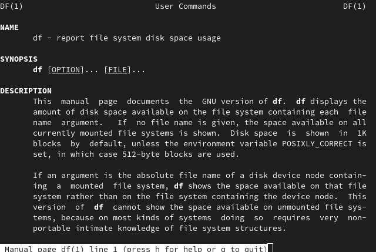{ #fig:012 width=70% }

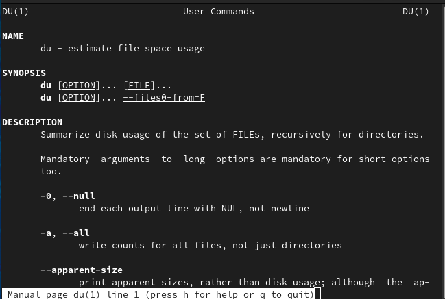{ #fig:013 width=70% }

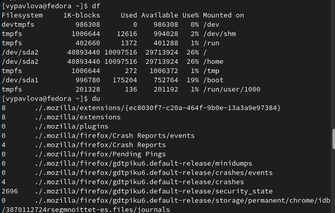{ #fig:014 width=70% }

11. Воспользовавшись справкой команды find(рис. [-@fig:015]), вывожу имена всех директорий,имею-
щихся в домашнем каталоге.  (рис. [-@fig:016]) 

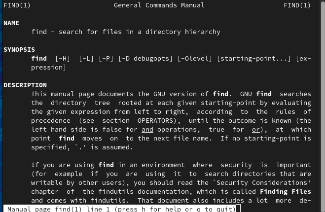{ #fig:015 width=70% }

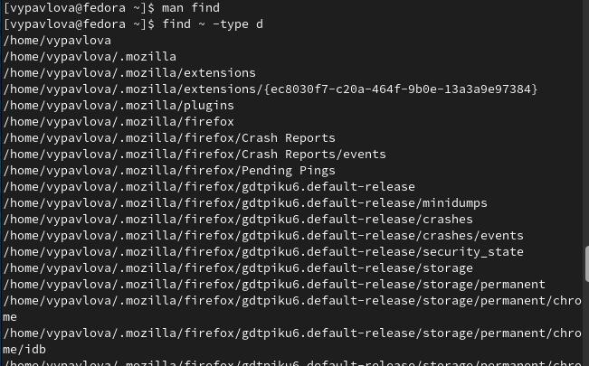{ #fig:016 width=70% }

# Выводы

Выполняя данную лабораторную работу я ознакомилась с инструментами поиска файлов и фильтрации текстовых данных и приобрела практические навыки по управлению процессами, проверке использования диска и обслуживанию файловых систем.

# Список литературы{.unnumbered}

::: {#refs}
:::
