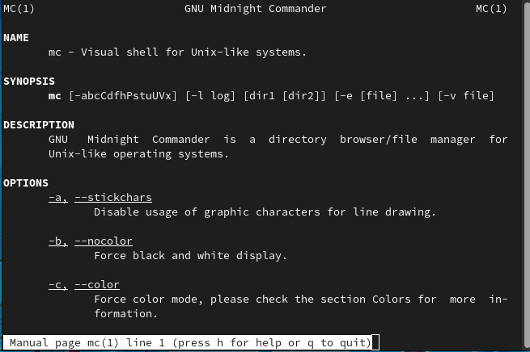
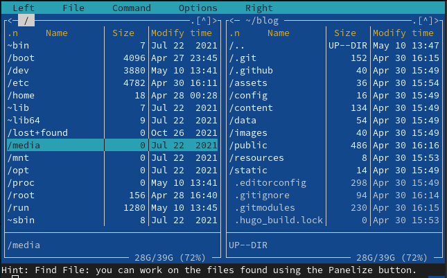
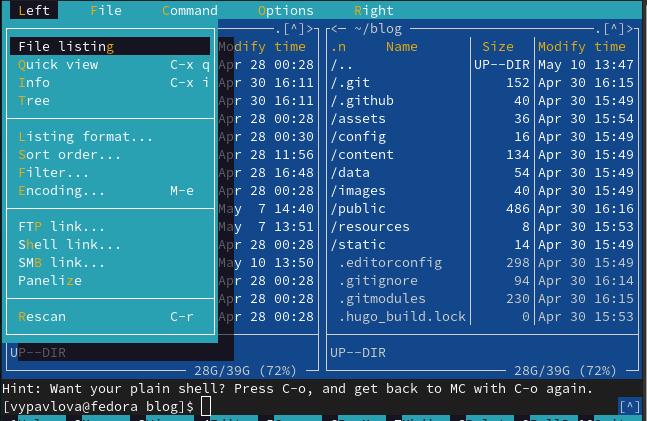
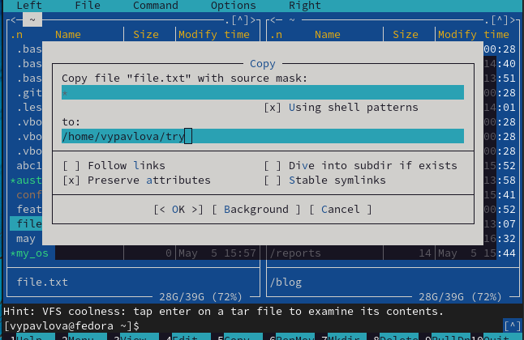
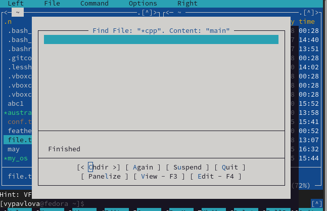
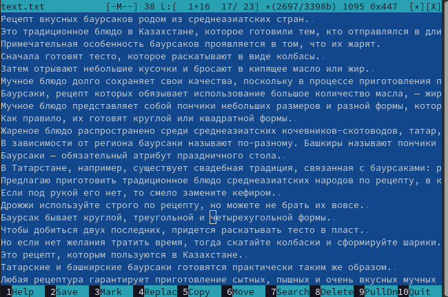
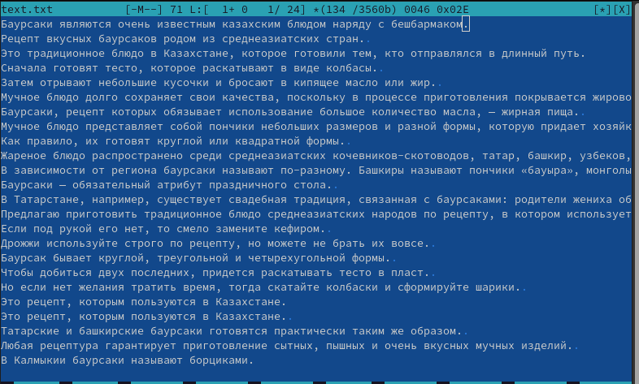
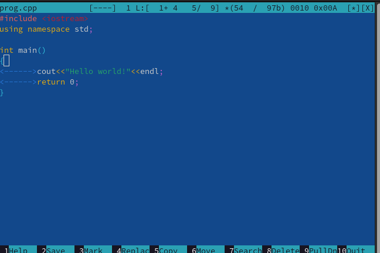

---
## Front matter
lang: ru-RU
title: Отчет по лабораторной работе №7
author: |
	Павлова Варвара Юрьевна НПМбд-02-21
institute: |
	Российский Университет Дружбы народов
date: Москва, 2022

## Formatting
toc: false
slide_level: 2
theme: metropolis
header-includes: 
  - '\makeatletter'
  - '\makeatother'
aspectratio: 43
section-titles: true
---

# Цель работы - освоение основных возможностей командной оболочки Midnight Commander. Приобретение навыков практической работы по просмотру каталогов и файлов; манипуляций с ними.

# Ход работы

## Man mc

Изучаю информацию о mc,вызвав в командной строке man mc.(рис. [-@fig:001])

{ #fig:001 width=70% }

## Запуск mc

Запускаю из командной строки mc,изучаю его структуру и меню.(рис. [-@fig:002])

{ #fig:002 width=70% }

## Основные команды

Выполняю основные команды меню левой (или правой) панели.(рис. [-@fig:003])

{ #fig:003 width=70% }

## Копирование

Копирую в файл в созданный каталог.(рис. [-@fig:004])

{ #fig:004 width=70% }

## Поиск

Ищу в файловой системе файл с заданными условиями (файл с расширением .cpp,содержащий строку main). (рис. [-@fig:005])

{ #fig:005 width=70% }

## Текстовый редактор
Создаю текстовой файл text.txt. Открываю этот файл с помощью встроенного в mc редактора. Вставляю в открытый файл небольшой фрагмент текста,скопированный из Интернета.(рис. [-@fig:006])

{ #fig:006 width=70% }

## Изменение текста

Используя горячие клавиши, меняю текст. (рис. [-@fig:007])

{ #fig:007 width=70% }

## Подсветка синтаксиса

Открываю файл с исходным текстом на некотором языке программирования (C++) и используя меню редактора,включаю подсветку синтаксиса. (рис. [-@fig:008])

{ #fig:008 width=70% }

## Выводы

Выполняя данную лабораторную работу я приобрела навыки работы с Midnight Commander и файловой системой Linux.

