---
## Front matter
title: "Отчет"
subtitle: "Лабораторная работа №7"
author: "Павлова Варвара Юрьевна НПМбд-02-21"

## Generic otions
lang: ru-RU
toc-title: "Содержание"

## Bibliography
bibliography: bib/cite.bib
csl: pandoc/csl/gost-r-7-0-5-2008-numeric.csl

## Pdf output format
toc: true # Table of contents
toc-depth: 2
lof: true # List of figures
lot: true # List of tables
fontsize: 12pt
linestretch: 1.5
papersize: a4
documentclass: scrreprt
## I18n polyglossia
polyglossia-lang:
  name: russian
  options:
	- spelling=modern
	- babelshorthands=true
polyglossia-otherlangs:
  name: english
## I18n babel
babel-lang: russian
babel-otherlangs: english
## Fonts
mainfont: PT Serif
romanfont: PT Serif
sansfont: PT Sans
monofont: PT Mono
mainfontoptions: Ligatures=TeX
romanfontoptions: Ligatures=TeX
sansfontoptions: Ligatures=TeX,Scale=MatchLowercase
monofontoptions: Scale=MatchLowercase,Scale=0.9
## Biblatex
biblatex: true
biblio-style: "gost-numeric"
biblatexoptions:
  - parentracker=true
  - backend=biber
  - hyperref=auto
  - language=auto
  - autolang=other*
  - citestyle=gost-numeric
## Pandoc-crossref LaTeX customization
figureTitle: "Рис."
tableTitle: "Таблица"
listingTitle: "Листинг"
lofTitle: "Список иллюстраций"
lotTitle: "Список таблиц"
lolTitle: "Листинги"
## Misc options
indent: true
header-includes:
  - \usepackage{indentfirst}
  - \usepackage{float} # keep figures where there are in the text
  - \floatplacement{figure}{H} # keep figures where there are in the text
---

# Цель работы

Освоение основных возможностей командной оболочки Midnight Commander. Приобретение навыков практической работы по просмотру каталогов и файлов; манипуляций с ними.

# Задание

**Задание по mc**

1. Изучите информацию о mc,вызвав в командной строке man mc.
2. Запустите из командной строки mc,изучите его структуру и меню.
ыполните несколько операций в mc,используя управляющие клавиши (операции
с панелями; выделение/отмена выделения файлов,копирование/перемещение фай-
лов, получение информации о размере и правах доступа на файлы и/или каталоги
ит.п.)
4. Выполните основные команды меню левой (или правой) панели.Оцените степень
подробности вывода информации о файлах.
5. Используя возможности подменю Файл ,выполните:
	– просмотр содержимоготекстового файла;
	– редактирование содержимого текстового файла (без сохранения результатов
	редактирования);
	– создание каталога;
	– копирование в файлов в созданный каталог.
6. С помощью соответствующих средств подменю Команда осуществите:
	– поиск в файловой системе файла с заданными условиями (например, файла
	с расширением .c или .cpp,содержащего строку main);
	– выбор и повторение одной из предыдущих команд;
	– переход в домашний каталог;
	– анализ файла меню и файла расширений.
7. Вызовите подменю Настройки. Освойте операции,определяющие структуру экрана mc
(Full screen,Double Width,Show Hidden Files ит.д.).

**Задание по встроенному редактору mc**

1. Создайтетекстовой файл text.txt.
2. Откройте этот файл с помощью встроенного в mc редактора.
3. Вставьте в открытый файл небольшой фрагменттекста,скопированный из любого
другого файла или Интернета.
4. Проделайте стекстом следующие манипуляции,используя горячие клавиши:
	4.1. Удалите строкутекста.
	4.2. Выделите фрагменттекста и скопируйте его на новую строку
	4.3. Выделите фрагменттекста и перенесите его на новую строку.
	4.4. Сохраните файл.
	4.5. Отмените последнее действие.
	4.6. Перейдите в конец файла (нажав комбинацию клавиш) и напишите некоторый
	текст.
	4.7. Перейдите в начало файла (нажав комбинацию клавиш) и напишите некоторый
	текст.
	4.8. Сохраните и закройте файл.
5. Откройте файл с исходнымтекстом на некотором языке программирования (напри-
мер C или Java)
6. Используя меню редактора,включите подсветку синтаксиса,если она не включена,
или выключите,если она включена.

# Теоретическое введение

Командная оболочка—интерфейс взаимодействия пользователя с операционной систе-
мой и программным обеспечением посредством команд.
MidnightCommander (илиmc)—псевдографическаякоманднаяоболочкадляUNIX/Linux
систем.Для запуска mc необходимо в командной строке набрать mc и нажать Enter .
Рабочее пространство mc имеет две панели, отображающие по умолчанию списки
файлов двух каталогов.

# Выполнение лабораторной работы

**Задание по mc**

1. Изучаю информацию о mc,вызвав в командной строке man mc.(рис. [-@fig:001])

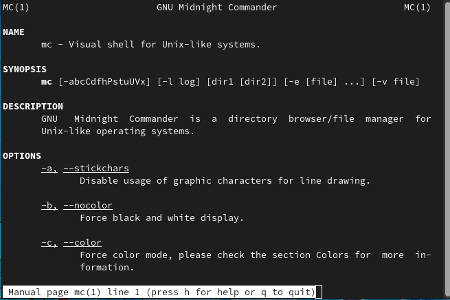{ #fig:001 width=70% }

2. Запускаю из командной строки mc,изучаю его структуру и меню.(рис. [-@fig:002])

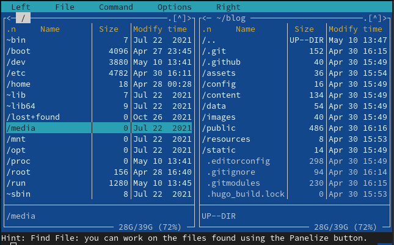{ #fig:002 width=70% }

3. Выполняю несколько операций в mc,используя управляющие клавиши (операции
с панелями(рис. [-@fig:003]); выделение(рис. [-@fig:004])/отмена выделения файлов(рис. [-@fig:005]),копирование/перемещение файлов(рис. [-@fig:006]), получение информации о размере и правах доступа на файлы и/или каталоги
ит.п.)

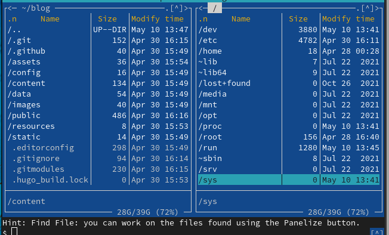{ #fig:003 width=70% }

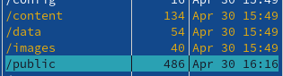{ #fig:004 width=70% }

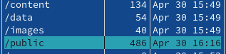{ #fig:005 width=70% }

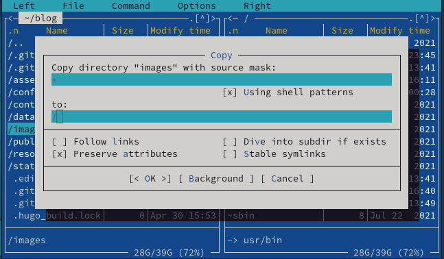{ #fig:006 width=70% }

4. Выполняю основные команды меню левой (или правой) панели.(рис. [-@fig:007]) (рис. [-@fig:008])

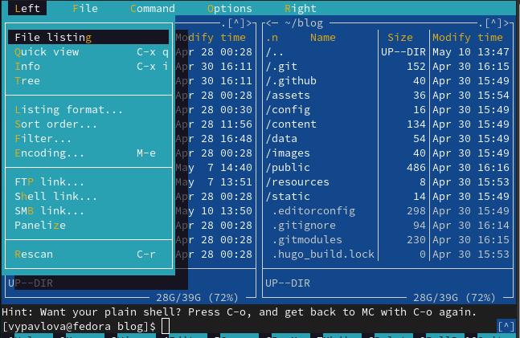{ #fig:007 width=70% }

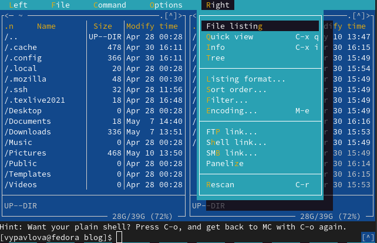{ #fig:008 width=70% }

5. Используя возможности подменю Файл ,выполняю:
	– просмотр содержимого текстового файла;(рис. [-@fig:009])

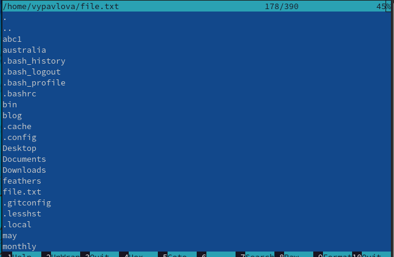{ #fig:009 width=70% }

	– редактирование содержимого текстового файла (без сохранения результатов
	редактирования); (рис. [-@fig:010])

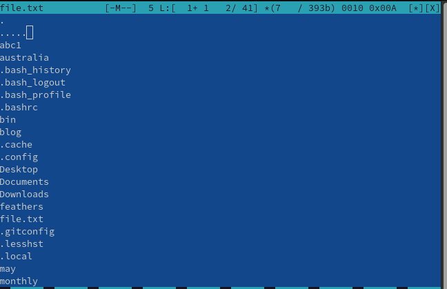{ #fig:010 width=70% }

	– создание каталога;(рис. [-@fig:011])

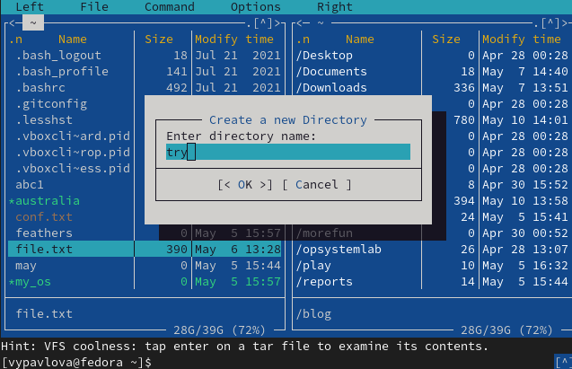{ #fig:011 width=70% }

	– копирование в файлов в созданный каталог.(рис. [-@fig:012])

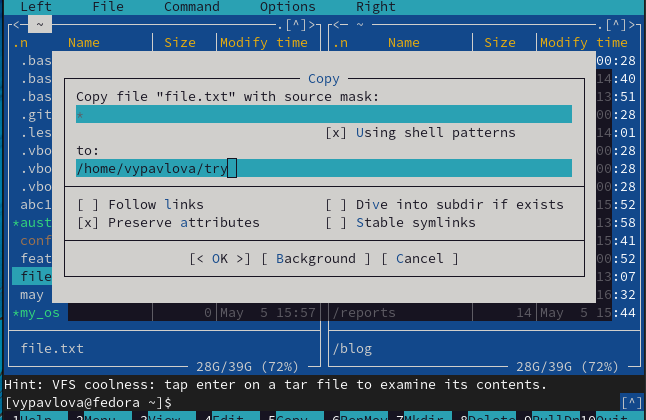{ #fig:012 width=70% }

6. С помощью соответствующих средств подменю Команда осуществляю:
	– поиск в файловой системе файла с заданными условиями (файла
	с расширением .cpp,содержащего строку main);(рис. [-@fig:013])

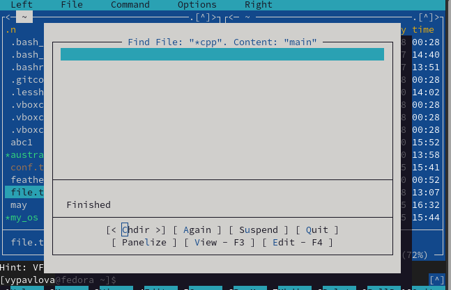{ #fig:013 width=70% }

	– выбор и повторение одной из предыдущих команд;(рис. [-@fig:014])

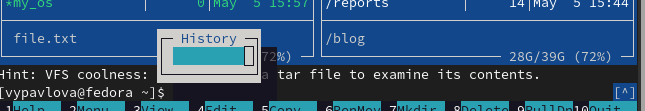{ #fig:014 width=70% }

	– переход в домашний каталог;(рис. [-@fig:015])

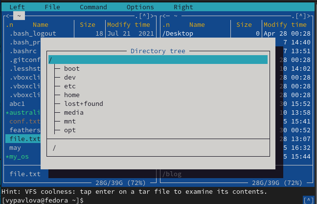{ #fig:015 width=70% }

	– анализ файла меню и файла расширений.(рис. [-@fig:016])(рис. [-@fig:017])

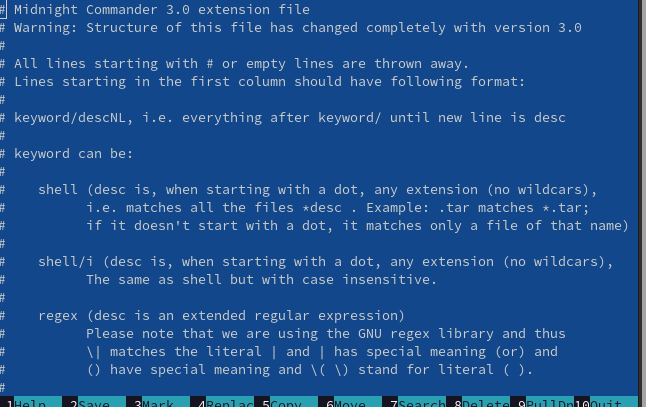{ #fig:016 width=70% }

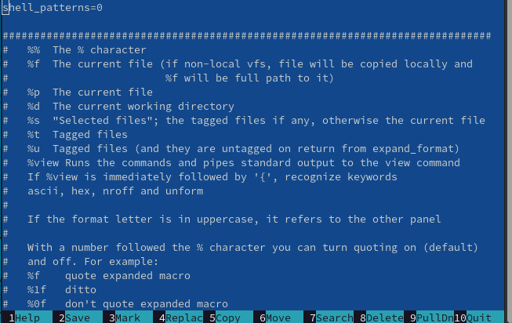{ #fig:017 width=70% }

7. Вызываю подменю Настройки. Смотрю операции,определяющие структуру экрана mc.(рис. [-@fig:018])

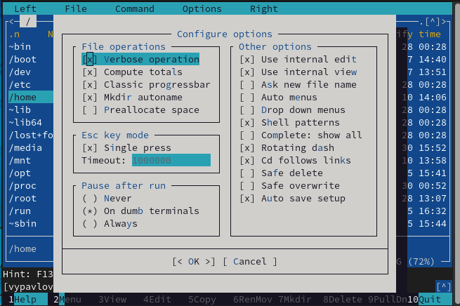{ #fig:018 width=70% }

**Задание по встроенному редактору mc**

1. Создаю текстовой файл text.txt.(рис. [-@fig:019])

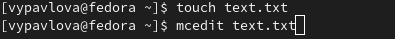{ #fig:019 width=70% }

2. Открываю этот файл с помощью встроенного в mc редактора. 

3. Вставляю в открытый файл небольшой фрагментт екста,скопированный из любого
другого файла или Интернета.(рис. [-@fig:020])

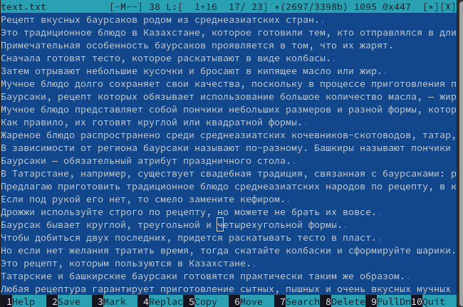{ #fig:020 width=70% }

4. Проделываю с текстом следующие манипуляции,используя горячие клавиши:
	4.1. Удаляю строку текста.
	4.2. Выделяю фрагмент текста и копирую его на новую строку
	4.3. Выделяю фрагмент текста и переношу его на новую строку.
	4.4. Сохраняю файл.
	4.5. Отменяю последнее действие.
	4.6. Перехожу в конец файла (нажав комбинацию клавиш) и напишите некоторый
	текст.
	4.7. Перехожу в начало файла (нажав комбинацию клавиш) и напишите некоторый
	текст.
	4.8. Сохраняю и закрываю файл. (рис. [-@fig:021])

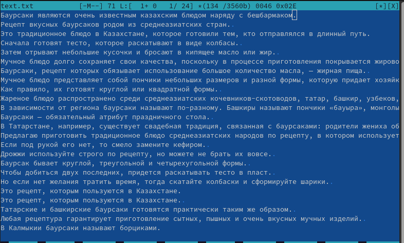{ #fig:021 width=70% }

5. Открываю файл с исходным текстом на некотором языке программирования (C++) и используя меню редактора,включаю подсветку синтаксиса. (рис. [-@fig:022])

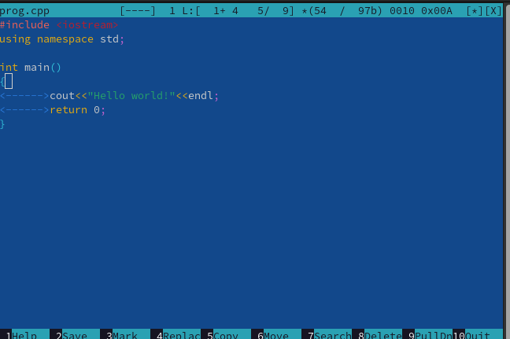{ #fig:022 width=70% }

# Выводы

Выполняя данную лабораторную работу я приобрела навыки работы с Midnight Commander и файловой системой Linux.

# Список литературы{.unnumbered}

::: {#refs}
:::
