---
## Front matter
lang: ru-RU
title: Отчет по лабораторной работе №8
author: |
	Павлова Варвара Юрьевна НПМбд-02-21
institute: |
	Российский Университет Дружбы народов
date: Москва, 2022

## Formatting
toc: false
slide_level: 2
theme: metropolis
header-includes: 
  - '\makeatletter'
  - '\makeatother'
aspectratio: 43
section-titles: true
---

## Цель работы 
Познакомиться с операционной системой Linux. Получить практические навыки работы с редактором vi, установленным по умолчанию практически во всех дистрибутивах.

# Ход работы

## Начало работы

1. Ознакомилась с теоретическим материалом.
2. Ознакомилась с редактором vi.
3. Выполняю упражнения, используя команды vi.

# Создание нового файла с использованием vi

## Создание каталога

Создаю каталог с именем ~/work/os/lab06 и перехожу в него. (рис. [-@fig:001])

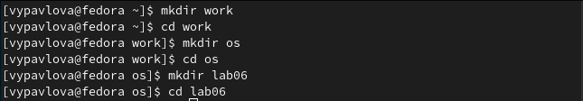{ #fig:001 width=70% }

## Вызов vi

Вызываю vi и создаю файл hello.sh (рис. [-@fig:002])

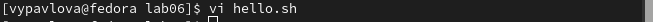{ #fig:002 width=70% }

## Ввод текста

Нажимаю клавишу i и ввожу следующий текст.(рис. [-@fig:003])

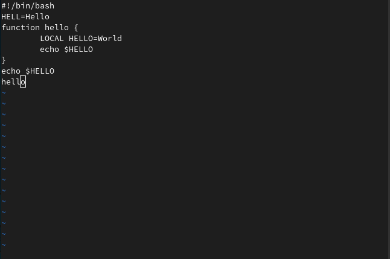{ #fig:003 width=70% }

## Окончание работы с содержимым файла

Нажимаю клавишу Esc для перехода в командный режим после завершения ввода
текста.

Нажимаю : для перехода в режим последней строки и внизу вашего экрана появится
приглашение в виде двоеточия.

Нажимаю w (записать) и q (выйти), а затем нажимаю клавишу Enter для сохранения текста и завершения работы.

## Изменение прав доступа

Делаю файл исполняемым. (рис. [-@fig:004])

{ #fig:004 width=70% }

# Редактирование существующего файла

## Изменение текста

Вызываю vi на редактирование файла
Устанавливаю курсор в конец слова HELL второй строки.(рис. [-@fig:005])

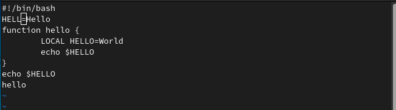{ #fig:005 width=70% }

## Изменение текста

Перехожу в режим вставки и заменяю на HELLO. Нажимаю Esc для возврата в командный режим.(рис. [-@fig:006])

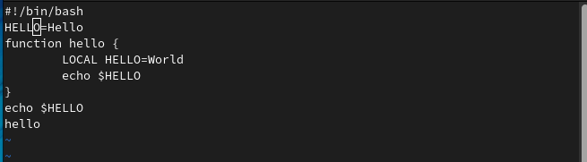{ #fig:006 width=70% }

## Изменение текста

Устанавливаю курсор на четвертую строку и стираю слово LOCAL. (рис. [-@fig:007])

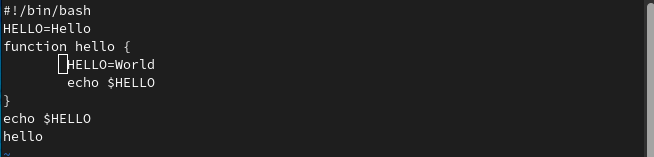{ #fig:007 width=70% }

## Изменение текста

Перехожу в режим вставки и набираю следующий текст: local, нажимаю Esc для
возврата в командный режим.(рис. [-@fig:008])

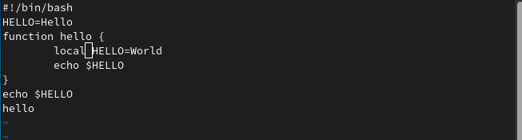{ #fig:008 width=70% }

## Изменение текста

Устанавливаю курсор на последней строке файла. Вставляю после неё строку, содержащую
следующий текст: echo $HELLO.(рис. [-@fig:009])

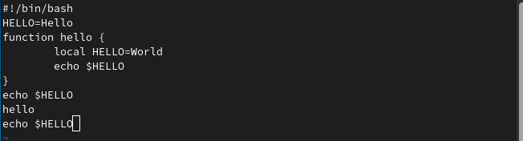{ #fig:009 width=70% }

## Изменение текста

Нажимаю Esc для перехода в командный режим.
Удаляю последнюю строку.(рис. [-@fig:010])

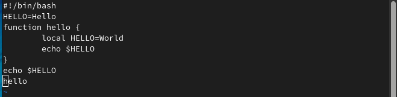{ #fig:010 width=70% }

## Изменение текста

Ввожу команду отмены изменений u для отмены последней команды.(рис. [-@fig:011])

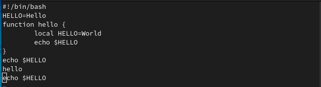{ #fig:011 width=70% }

## Изменение текста

Ввожу символ : для перехода в режим последней строки. Записываю произведённые
изменения и выхожу из vi.(рис. [-@fig:012])

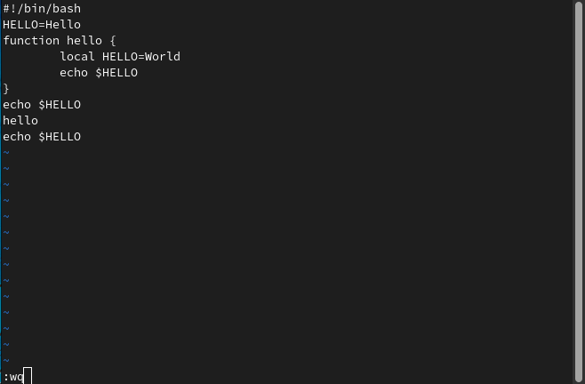{ #fig:012 width=70% }

## Выводы

Выполняя данную лабораторную работу я приобрела навыки работы с редактором vi и операционной системой Linux.

