---
## Front matter
lang: ru-RU
title: Отчет по лабораторной работе №9
author: |
	Павлова Варвара Юрьевна НПМбд-02-21
institute: |
	Российский Университет Дружбы народов
date: Москва, 2022

## Formatting
toc: false
slide_level: 2
theme: metropolis
header-includes: 
  - '\makeatletter'
  - '\makeatother'
aspectratio: 43
section-titles: true
---

## Цель работы 

Познакомиться с операционной системой Linux. Получить практические навыки рабо-
ты с редактором Emacs.

# Ход работы

## Начало работы

1. Я ознакомилась с теоретическим материалом.
2. Я ознакомилась с редактором emacs.
3. Я выполнила упражнения.

# Основные команды emacs

## Установка emacs

Устанавливаю emacs. (рис. [-@fig:001])

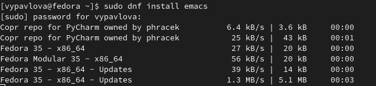{ #fig:001 width=70% }

## Запуск emacs

Открываю редактор.(рис. [-@fig:002]) 

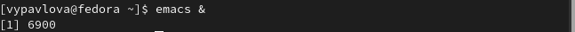{ #fig:002 width=70% }

## Создание файла

Создаю файл lab07.sh с помощью комбинации Ctrl-x Ctrl-f (C-x C-f).(рис. [-@fig:003])

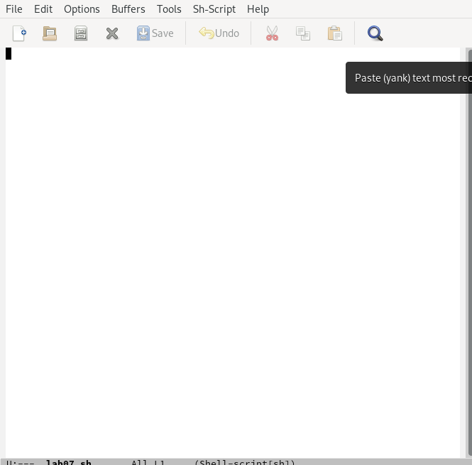{ #fig:003 width=70% }

## Набор текста

Набираю текст.(рис. [-@fig:004])

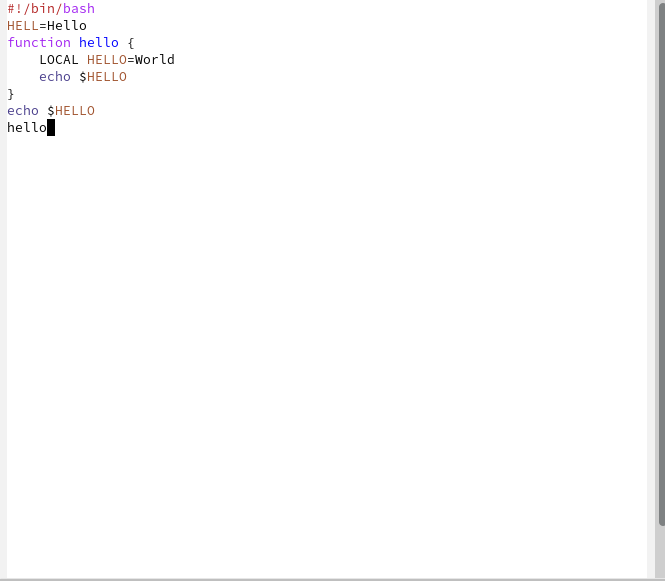{ #fig:004 width=70% }

## Управление буферами

 Вывожу список активных буферов на экран (C-x C-b).(рис. [-@fig:005])

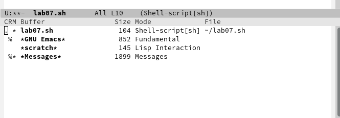{ #fig:005 width=70% }

## Управление окнами

Делю фрейм на 4 части: сначала на два окна по вертикали (C-x 3), а затем каждое из этих окон на две части по горизонтали (C-x 2).(рис. [-@fig:006])

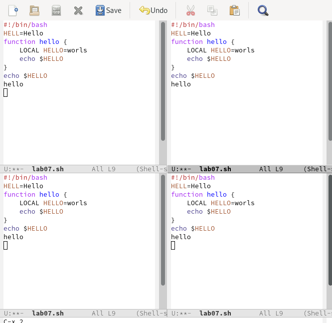{ #fig:006 width=70% }

## Создание буферов

В каждом из четырёх созданных окон открываю новый буфер (файл) и ввожу несколько строк текста.(рис. [-@fig:007])

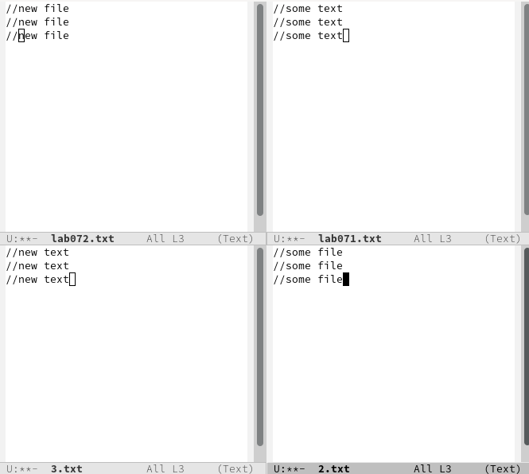{ #fig:007 width=70% }

## Режим поиска

Переключаюсь в режим поиска (C-s) и нахожу несколько слов, присутствующих в тексте.(рис. [-@fig:008])

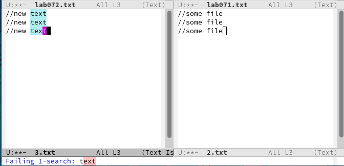{ #fig:008 width=70% }

## Режим поиска

Переключаюсь между результатами поиска, нажимая C-s.(рис. [-@fig:009])

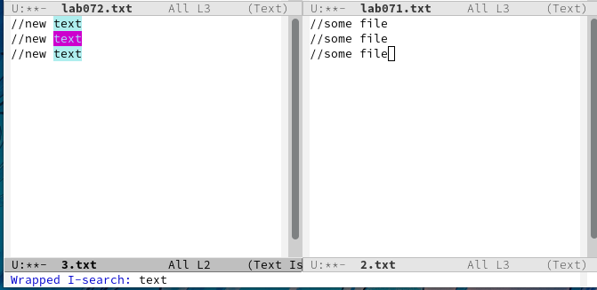{ #fig:009 width=70% }

## Режим поиска

Выхожу из режима поиска, нажав C-g.(рис. [-@fig:010])

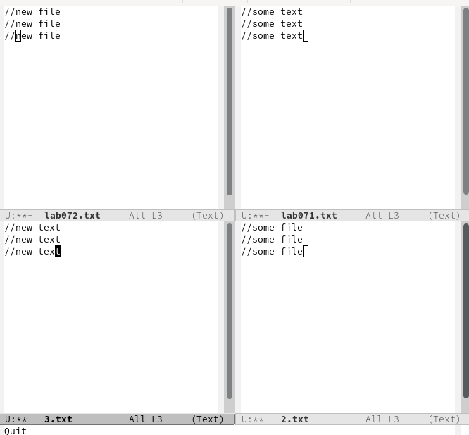{ #fig:010 width=70% }

## Режим поиска

Пробую другой режим поиска, нажав M-s o.(рис. [-@fig:011])

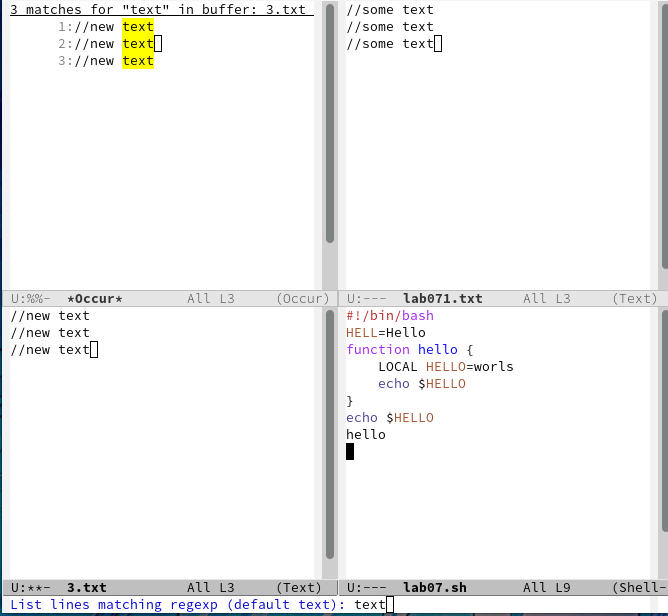{ #fig:011 width=70% }

## Выводы

Выполняя данную лабораторную работу я приобрела навыки работы с редактором emacs и операционной системой Linux.

