---
## Front matter
title: "Отчет"
subtitle: "Лабораторная работа №9"
author: "Павлова Варвара Юрьевна НПМбд-02-21"

## Generic otions
lang: ru-RU
toc-title: "Содержание"

## Bibliography
bibliography: bib/cite.bib
csl: pandoc/csl/gost-r-7-0-5-2008-numeric.csl

## Pdf output format
toc: true # Table of contents
toc-depth: 2
lof: true # List of figures
lot: true # List of tables
fontsize: 12pt
linestretch: 1.5
papersize: a4
documentclass: scrreprt
## I18n polyglossia
polyglossia-lang:
  name: russian
  options:
	- spelling=modern
	- babelshorthands=true
polyglossia-otherlangs:
  name: english
## I18n babel
babel-lang: russian
babel-otherlangs: english
## Fonts
mainfont: PT Serif
romanfont: PT Serif
sansfont: PT Sans
monofont: PT Mono
mainfontoptions: Ligatures=TeX
romanfontoptions: Ligatures=TeX
sansfontoptions: Ligatures=TeX,Scale=MatchLowercase
monofontoptions: Scale=MatchLowercase,Scale=0.9
## Biblatex
biblatex: true
biblio-style: "gost-numeric"
biblatexoptions:
  - parentracker=true
  - backend=biber
  - hyperref=auto
  - language=auto
  - autolang=other*
  - citestyle=gost-numeric
## Pandoc-crossref LaTeX customization
figureTitle: "Рис."
tableTitle: "Таблица"
listingTitle: "Листинг"
lofTitle: "Список иллюстраций"
lotTitle: "Список таблиц"
lolTitle: "Листинги"
## Misc options
indent: true
header-includes:
  - \usepackage{indentfirst}
  - \usepackage{float} # keep figures where there are in the text
  - \floatplacement{figure}{H} # keep figures where there are in the text
---

# Цель работы

Познакомиться с операционной системой Linux. Получить практические навыки рабо-
ты с редактором Emacs.

# Задание

1. Ознакомиться с теоретическим материалом.
2. Ознакомиться с редактором emacs.
3. Выполнить упражнения.
4. Ответить на контрольные вопросы.

**Основные команды emacs**

1. Открыть emacs.
2. Создать файл lab07.sh с помощью комбинации Ctrl-x Ctrl-f (C-x C-f).
3. Наберите текст.
4. Сохранить файл с помощью комбинации Ctrl-x Ctrl-s (C-x C-s).
5. Проделать с текстом стандартные процедуры редактирования, каждое действие долж-
но осуществляться комбинацией клавиш.
5.1. Вырезать одной командой целую строку (С-k).
5.2. Вставить эту строку в конец файла (C-y).
5.3. Выделить область текста (C-space).
5.4. Скопировать область в буфер обмена (M-w).
5.5. Вставить область в конец файла.
5.6. Вновь выделить эту область и на этот раз вырезать её (C-w).
5.7. Отмените последнее действие (C-/).
6. Научитесь использовать команды по перемещению курсора.
6.1. Переместите курсор в начало строки (C-a).
6.2. Переместите курсор в конец строки (C-e).
6.3. Переместите курсор в начало буфера (M-<).
6.4. Переместите курсор в конец буфера (M->).
7. Управление буферами.
7.1. Вывести список активных буферов на экран (C-x C-b).
7.2. Переместитесь во вновь открытое окно (C-x) o со списком открытых буферов и переключитесь на другой буфер.
7.3. Закройте это окно (C-x 0).
7.4. Теперь вновь переключайтесь между буферами, но уже без вывода их списка на экран (C-x b).
8. Управление окнами.
8.1. Поделите фрейм на 4 части: разделите фрейм на два окна по вертикали (C-x 3), а затем каждое из этих окон на две части по горизонтали (C-x 2).
8.2. В каждом из четырёх созданных окон откройте новый буфер (файл) и введите несколько строк текста.
9. Режим поиска
9.1. Переключитесь в режим поиска (C-s) и найдите несколько слов, присутствующих в тексте.
9.2. Переключайтесь между результатами поиска, нажимая C-s.
9.3. Выйдите из режима поиска, нажав C-g.
9.4. Перейдите в режим поиска и замены (M-%), введите текст, который следует найти и заменить, нажмите Enter , затем введите текст для замены. После того как будут подсвечены результаты поиска, нажмите ! для подтверждения замены.
9.5. Испробуйте другой режим поиска, нажав M-s o. Объясните, чем он отличается от обычного режима?

# Теоретическое введение

**Определение 1.** Буфер — объект, представляющий какой-либо текст.
Буфер может содержать что угодно, например, результаты компиляции программы или встроенные подсказки. Практически всё взаимодействие с пользователем, в том числе интерактивное, происходит посредством буферов.

**Определение 2.** Фрейм соответствует окну в обычном понимании этого слова. Каждый
фрейм содержит область вывода и одно или несколько окон Emacs.

**Определение 3.** Окно — прямоугольная область фрейма, отображающая один из буферов.
Каждое окно имеет свою строку состояния, в которой выводится следующая информация: название буфера, его основной режим, изменялся ли текст буфера и как далеко вниз по буферу расположен курсор. Каждый буфер находится только в одном из возможных основных режимов. Существующие основные режимы включают режим Fundamental(наименее специализированный), режим Text, режим Lisp, режим С, режим Texinfo и другие. Под второстепенными режимами понимается список режимов, которые включены в данный момент в буфере выбранного окна.

**Определение 4.** Область вывода — одна или несколько строк внизу фрейма, в которой Emacs выводит различные сообщения, а также запрашивает подтверждения и дополнительную информацию от пользователя.

**Определение 5.** Минибуфер используется для ввода дополнительной информации и всегда отображается в области вывода.

**Определение 6.** Точка вставки — место вставки (удаления) данных в буфере.

# Выполнение лабораторной работы

1. Я ознакомилась с теоретическим материалом.
2. Я ознакомилась с редактором emacs.
3. Я выполнила упражнения.

**Основные команды emacs**

1. Устанавливаю emacs (рис. [-@fig:001]) и открываю его.(рис. [-@fig:002]) 

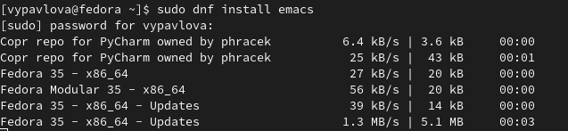{ #fig:001 width=70% }

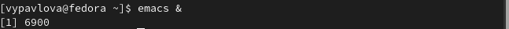{ #fig:002 width=70% }

2. Создаю файл lab07.sh с помощью комбинации Ctrl-x Ctrl-f (C-x C-f).(рис. [-@fig:003])

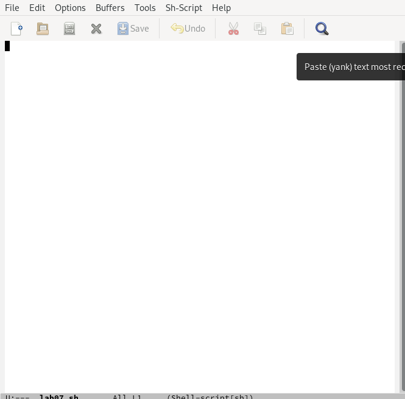{ #fig:003 width=70% }

3. Набираю текст.(рис. [-@fig:004])

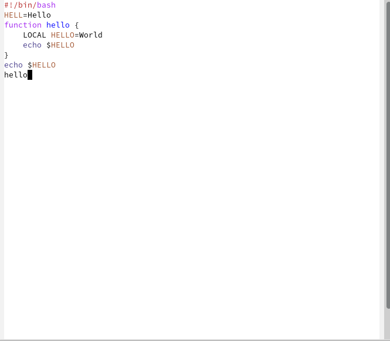{ #fig:004 width=70% }

4. Сохраню файл с помощью комбинации Ctrl-x Ctrl-s (C-x C-s).
5. Проделываю с текстом стандартные процедуры редактирования:
5.1. Вырезаю одной командой целую строку (С-k).(рис. [-@fig:005])

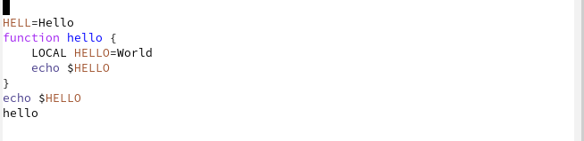{ #fig:005 width=70% }

5.2. Вставляю эту строку в конец файла (C-y).(рис. [-@fig:006])

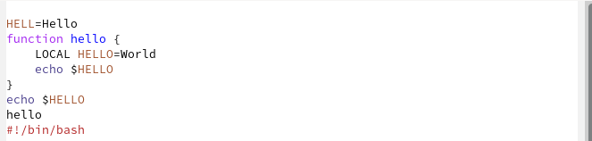{ #fig:006 width=70% }

5.3. Выделяю область текста (C-space).(рис. [-@fig:007])

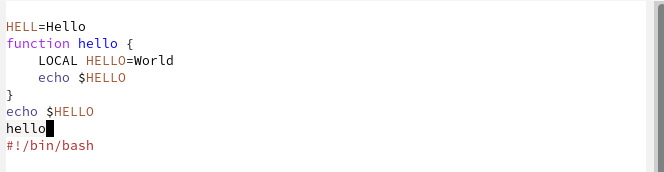{ #fig:007 width=70% }

5.4. Копирую выделенную область в буфер обмена (M-w).
5.5. Вставляю область в конец файла.(рис. [-@fig:008])

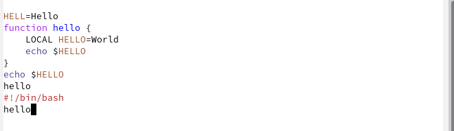{ #fig:008 width=70% }

5.6. Вновь выделяю эту область и на этот раз вырезаю её (C-w).(рис. [-@fig:009])

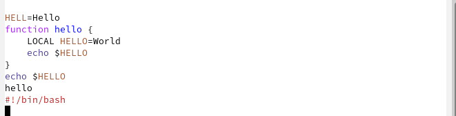{ #fig:009 width=70% }

5.7. Отменяю последнее действие (C-/).(рис. [-@fig:010])

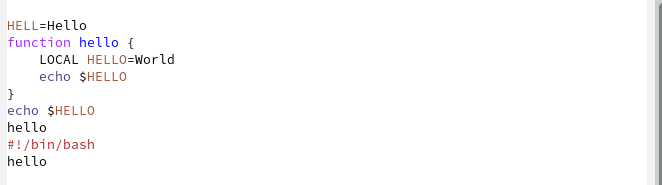{ #fig:010 width=70% }

6. Учусь использовать команды по перемещению курсора.
6.1. Перемещаю курсор в начало строки (C-a).
6.2. Перемещаю курсор в конец строки (C-e).
6.3. Перемещаю курсор в начало буфера (M-<).(рис. [-@fig:011])

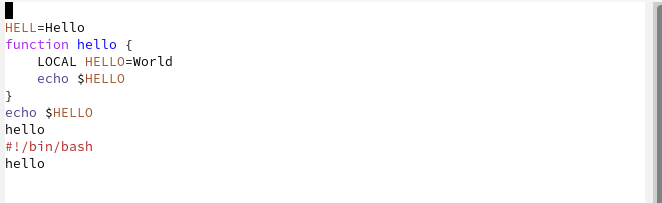{ #fig:011 width=70% }

6.4. Перемещаю курсор в конец буфера (M->).
7. Управление буферами.
7.1. Вывожу список активных буферов на экран (C-x C-b).(рис. [-@fig:012])

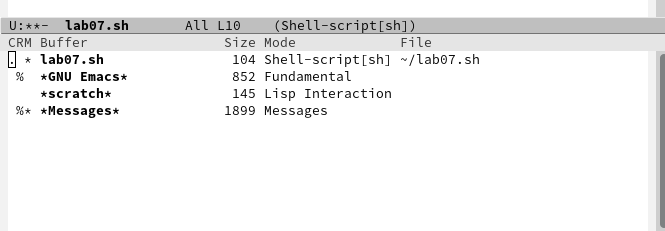{ #fig:012 width=70% }

7.2. Перемещаюсь во вновь открытое окно (C-x o) со списком открытых буферов и переключаюсь на другой буфер.
7.3. Закрываю это окно (C-x 0).
7.4. Теперь вновь переключаюсь между буферами, но уже без вывода их списка на экран (C-x b).(рис. [-@fig:013])

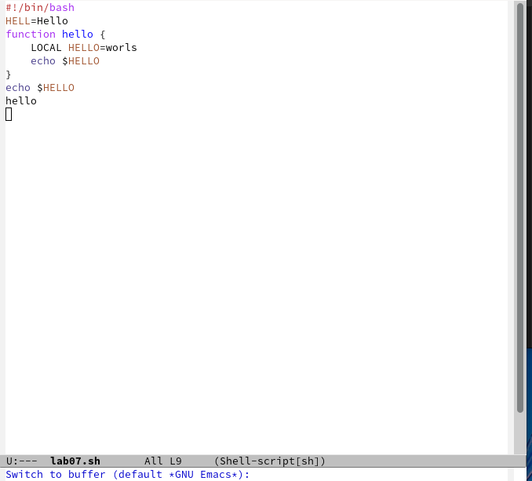{ #fig:013 width=70% }

8. Управление окнами.
8.1. Делю фрейм на 4 части: сначала на два окна по вертикали (C-x 3), а затем каждое из этих окон на две части по горизонтали (C-x 2).(рис. [-@fig:014])

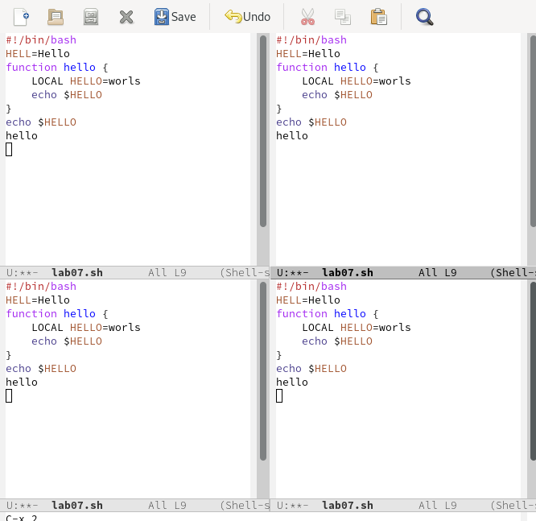{ #fig:014 width=70% }

8.2. В каждом из четырёх созданных окон открываю новый буфер (файл) и ввожу несколько строк текста.(рис. [-@fig:015])

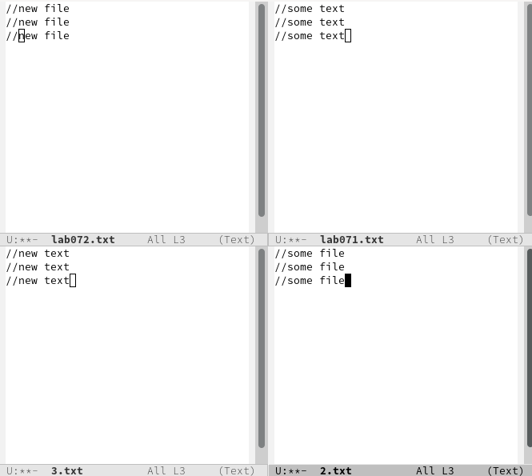{ #fig:015 width=70% }

9. Режим поиска
9.1. Переключаюсь в режим поиска (C-s) и нахожу несколько слов, присутствующих в тексте.(рис. [-@fig:016])

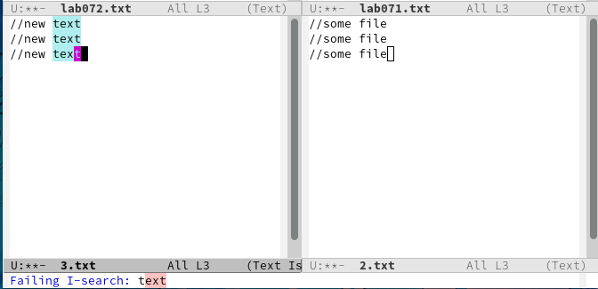{ #fig:016 width=70% }

9.2. Переключаюсь между результатами поиска, нажимая C-s.(рис. [-@fig:017])

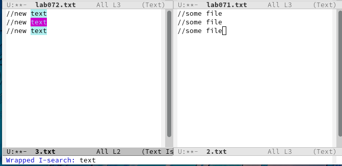{ #fig:017 width=70% }

9.3. Выхожу из режима поиска, нажав C-g.(рис. [-@fig:018])

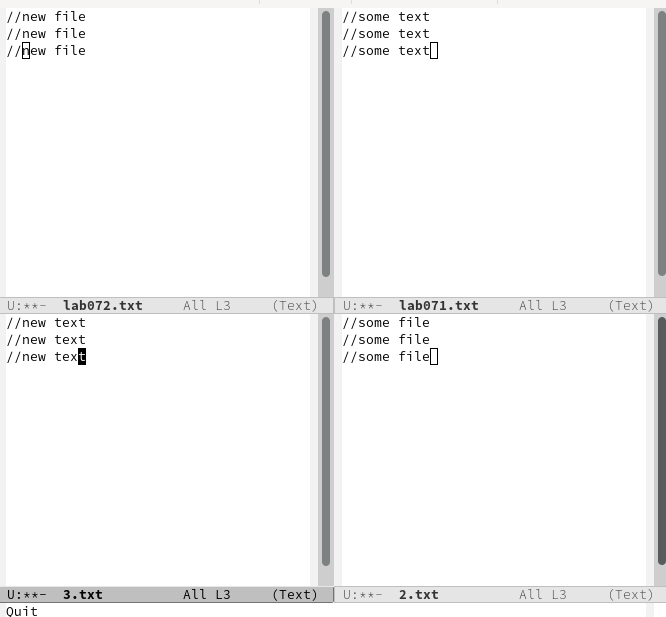{ #fig:018 width=70% }

9.4. К сожалению выполнение этого пункта мне не удалось, так как не распознается данная комбинация клавиш.
9.5. Пробую другой режим поиска, нажав M-s o.(рис. [-@fig:019])

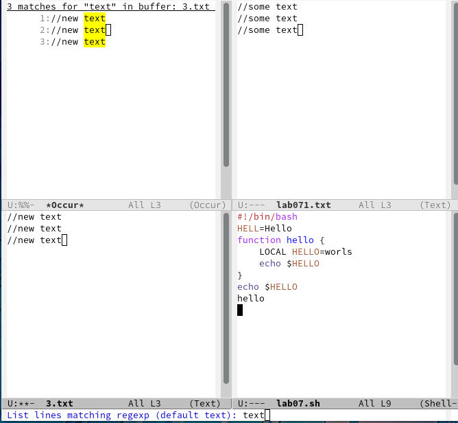{ #fig:019 width=70% }

# Выводы

Выполняя данную лабораторную работу я приобрела навыки работы с редактором emacs и операционной системой Linux.

# Список литературы{.unnumbered}

::: {#refs}
:::
