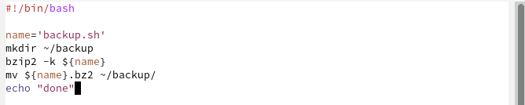
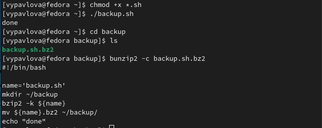
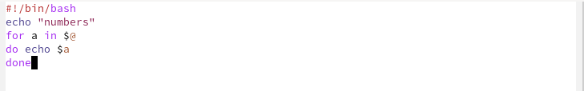
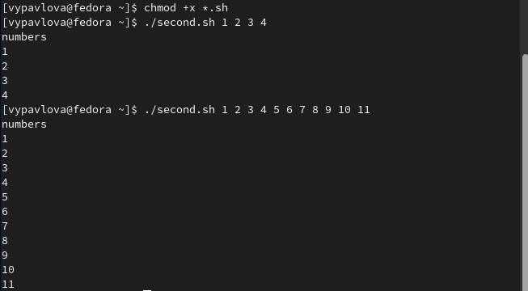
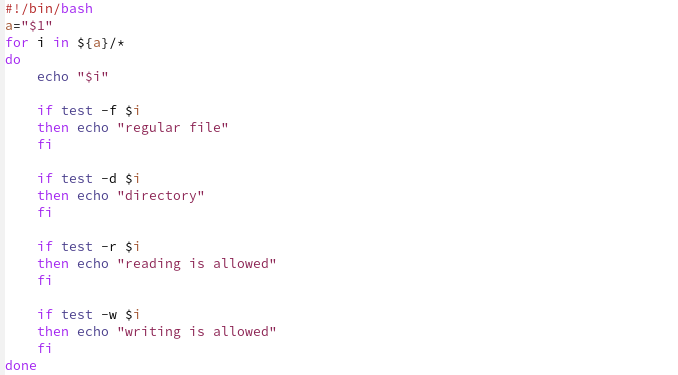
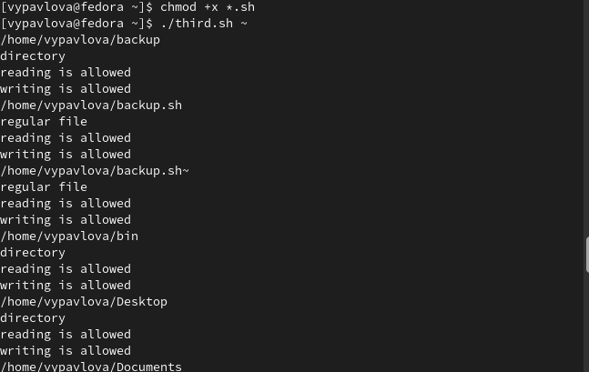
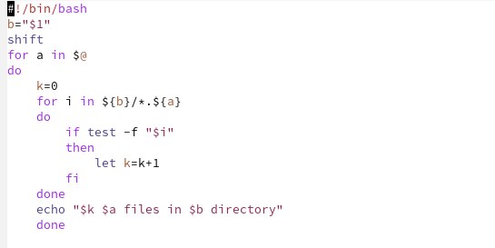
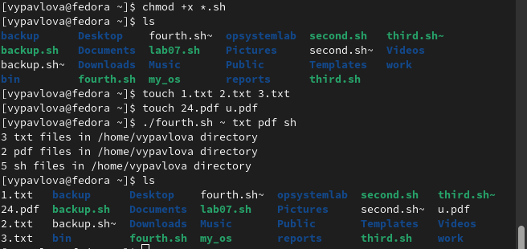

---
## Front matter
lang: ru-RU
title: Отчет по лабораторной работе №10
author: |
	Павлова Варвара Юрьевна НПМбд-02-21
institute: |
	Российский Университет Дружбы народов
date: Москва, 2022

## Formatting
toc: false
slide_level: 2
theme: metropolis
header-includes: 
  - '\makeatletter'
  - '\makeatother'
aspectratio: 43
section-titles: true
---

## Цель работы 

Изучить основы программирования в оболочке ОС UNIX/Linux. Научиться писать небольшие командные файлы.

# Ход работы

## Вызов справки об архиваторах

Изучаю информацию о командах архивации *zip*, *bzip2* и *tar* с помощью команды *man*.(рис. [-@fig:001])

{ #fig:001 width=70% }

# Первый скрипт

## Написание

Пишу скрипт, который при запуске будет делать резервную копию самого себя (то есть файла, в котором содержится его исходный код) в другую директорию backup в домашнем каталоге. При этом файл архивируется архиватором bzip2. (рис. [-@fig:002])

{ #fig:002 width=70% }

## Проверка работы

Добавляю право на выполнение файла и проверяю его работу. (рис. [-@fig:003])

{ #fig:003 width=70% }

# Второй скрипт

## Написание

Пишу командный файл, обрабатывающий любое произвольное число аргументов командной строки, в том числе превышающее десять. Скрипт последовательно распечатывает значения всех переданных аргументов. (рис. [-@fig:004])

{ #fig:004 width=70% }

## Проверка работы

Добавляю право на выполнение файла и проверяю его работу. (рис. [-@fig:005])

{ #fig:005 width=70% }

# Третий скрипт

## Написание

Пишу командный файл — аналог команды ls (без использования самой этой команды и команды dir). Скрипт выдает информацию о нужном каталоге и выводит информацию о возможностях доступа к файлам этого каталога.(рис. [-@fig:006])

{ #fig:006 width=70% }

## Проверка работы

Добавляю право на выполнение файла и проверяю его работу. (рис. [-@fig:007])

{ #fig:007 width=70% }

# Четвертый скрипт

## Написание

Пишу командный файл, который получает в качестве аргумента командной строки формат файла (.txt, .doc, .jpg, .pdf и т.д.) и вычисляет количество таких файлов в указанной директории. Путь к директории также передаётся в виде аргумента командной строки. (рис. [-@fig:008])

{ #fig:008 width=70% }

## Проверка работы

Добавляю право на выполнение файла и проверяю его работу. (рис. [-@fig:009])

{ #fig:009 width=70% }

## Выводы

Выполняя данную лабораторную работу я изучила основы программирования в оболочке ОС UNIX/Linux и научилась писать небольшие командные файлы.

