---
## Front matter
title: "Отчет"
subtitle: "Лабораторная работа №10"
author: "Павлова Варвара Юрьевна НПМбд-02-21"

## Generic otions
lang: ru-RU
toc-title: "Содержание"

## Bibliography
bibliography: bib/cite.bib
csl: pandoc/csl/gost-r-7-0-5-2008-numeric.csl

## Pdf output format
toc: true # Table of contents
toc-depth: 2
lof: true # List of figures
lot: true # List of tables
fontsize: 12pt
linestretch: 1.5
papersize: a4
documentclass: scrreprt
## I18n polyglossia
polyglossia-lang:
  name: russian
  options:
	- spelling=modern
	- babelshorthands=true
polyglossia-otherlangs:
  name: english
## I18n babel
babel-lang: russian
babel-otherlangs: english
## Fonts
mainfont: PT Serif
romanfont: PT Serif
sansfont: PT Sans
monofont: PT Mono
mainfontoptions: Ligatures=TeX
romanfontoptions: Ligatures=TeX
sansfontoptions: Ligatures=TeX,Scale=MatchLowercase
monofontoptions: Scale=MatchLowercase,Scale=0.9
## Biblatex
biblatex: true
biblio-style: "gost-numeric"
biblatexoptions:
  - parentracker=true
  - backend=biber
  - hyperref=auto
  - language=auto
  - autolang=other*
  - citestyle=gost-numeric
## Pandoc-crossref LaTeX customization
figureTitle: "Рис."
listingTitle: "Листинг"
lofTitle: "Список иллюстраций"
lolTitle: "Листинги"
## Misc options
indent: true
header-includes:
  - \usepackage{indentfirst}
  - \usepackage{float} # keep figures where there are in the text
  - \floatplacement{figure}{H} # keep figures where there are in the text
---

# Цель работы

Изучить основы программирования в оболочке ОС UNIX/Linux. Научиться писать небольшие командные файлы.

# Задание

1. Написать скрипт, который при запуске будет делать резервную копию самого себя (то
есть файла, в котором содержится его исходный код) в другую директорию backup
в вашем домашнем каталоге. При этом файл должен архивироваться одним из архиваторов на выбор zip, bzip2 или tar. Способ использования команд архивациинеобходимо узнать, изучив справку.
2. Написать пример командного файла, обрабатывающего любое произвольное число аргументов командной строки, в том числе превышающее десять. Например, скрипт может последовательно распечатывать значения всех переданных аргументов.
3. Написать командный файл — аналог команды ls (без использования самой этой команды и команды dir). Требуется, чтобы он выдавал информацию о нужном каталоге и выводил информацию о возможностях доступа к файлам этого каталога.
4. Написать командный файл, который получает в качестве аргумента командной строки формат файла (.txt, .doc, .jpg, .pdf и т.д.) и вычисляет количество таких файлов в указанной директории. Путь к директории также передаётся в виде аргумента командной строки.

# Теоретическое введение

Командный процессор (командная оболочка, интерпретатор команд shell) — это программа, позволяющая пользователю взаимодействовать с операционной системой компьютера. В операционных системах типа UNIX/Linux наиболее часто используются следующие реализации командных оболочек:
- оболочка Борна (Bourne shell или sh) — стандартная командная оболочка UNIX/Linux, содержащая базовый, но при этом полный набор функций;
- С-оболочка (или csh) — надстройка на оболочкой Борна, использующая С-подобный синтаксис команд с возможностью сохранения истории выполнения команд;
- оболочка Корна (или ksh) — напоминает оболочку С, но операторы управления программой совместимы с операторами оболочки Борна;
- BASH — сокращение от Bourne Again Shell (опять оболочка Борна), в основе своей совмещает свойства оболочек С и Корна (разработка компании Free Software Foundation).
POSIX (Portable Operating System Interface for Computer Environments) — набор стандартов описания интерфейсов взаимодействия операционной системы и прикладных программ.
Стандарты POSIX разработаны комитетом IEEE (Institute of Electrical and Electronics Engineers) для обеспечения совместимости различных UNIX/Linux-подобных операционных систем и переносимости прикладных программ на уровне исходного кода. POSIX-совместимые оболочки разработаны на базе оболочки Корна.
Рассмотрим основные элементы программирования в оболочке bash. В других оболочках большинство команд будет совпадать с описанными ниже.

# Выполнение лабораторной работы

1. Изучаю информацию о командах архивации *zip*(рис. [-@fig:002]), *bzip2* (рис. [-@fig:003]) и *tar*  (рис. [-@fig:004]) с помощью команды *man*.(рис. [-@fig:001])

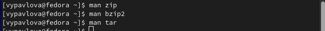{ #fig:001 width=70% }

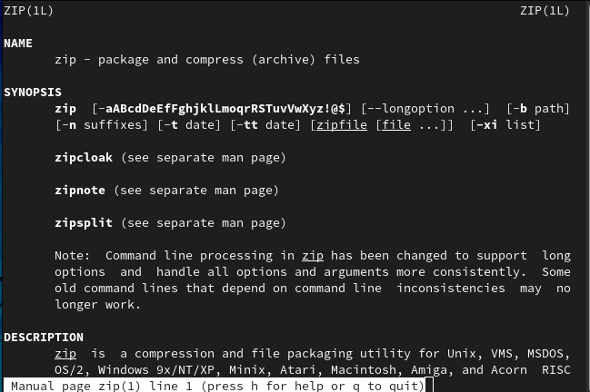{ #fig:002 width=70% }

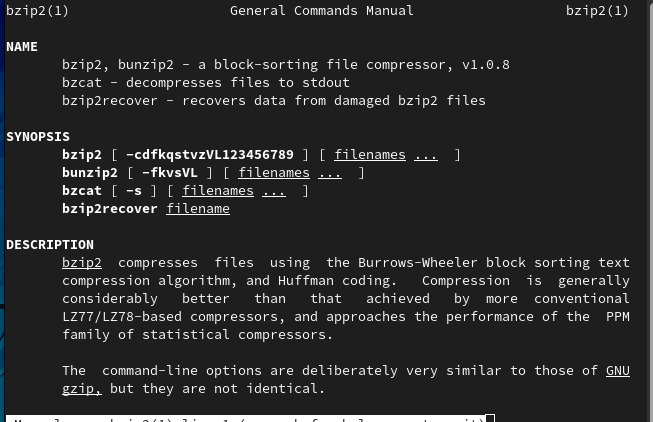{ #fig:003 width=70% }

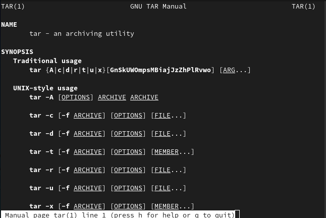{ #fig:004 width=70% }

2. Создаю первый исполняемый файл *backup.sh* и открываю редактор *emacs*. (рис. [-@fig:005])

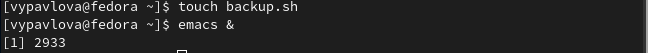{ #fig:005 width=70% }

3. Пишу скрипт, который при запуске будет делать резервную копию самого себя (то есть файла, в котором содержится его исходный код) в другую директорию backup в домашнем каталоге. При этом файл архивируется архиватором bzip2. (рис. [-@fig:006])

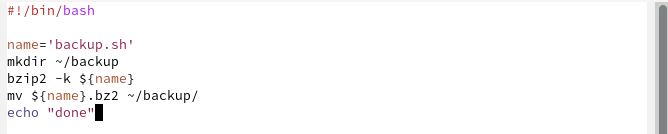{ #fig:006 width=70% }

4. Добавляю право на выполнение файла и проверяю его работу. (рис. [-@fig:007])

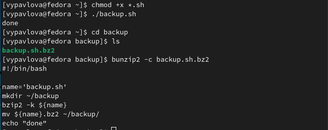{ #fig:007 width=70% }

5. Создаю второй исполняемый файл *second.sh* и открываю редактор *emacs*. (рис. [-@fig:008])

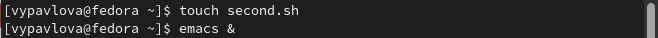{ #fig:008 width=70% }

6. Пишу командный файл, обрабатывающий любое произвольное число аргументов командной строки, в том числе превышающее десять. Скрипт последовательно распечатывает значения всех переданных аргументов. (рис. [-@fig:009])

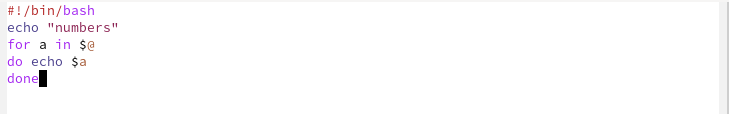{ #fig:009 width=70% }

7. Добавляю право на выполнение файла и проверяю его работу. (рис. [-@fig:010])

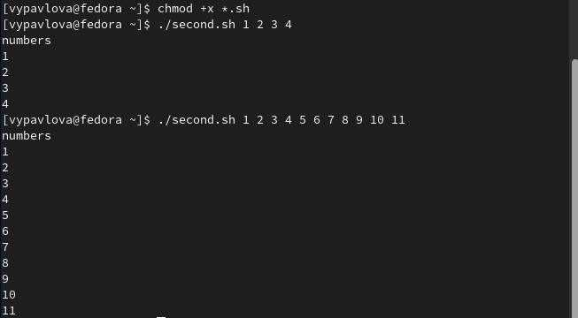{ #fig:010 width=70% }

8. Создаю третий исполняемый файл *third.sh* и открываю редактор *emacs*. (рис. [-@fig:011])

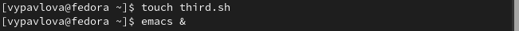{ #fig:011 width=70% }

9. Пишу командный файл — аналог команды ls (без использования самой этой команды и команды dir). Скрипт выдает информацию о нужном каталоге и выводит информацию о возможностях доступа к файлам этого каталога. (рис. [-@fig:012])

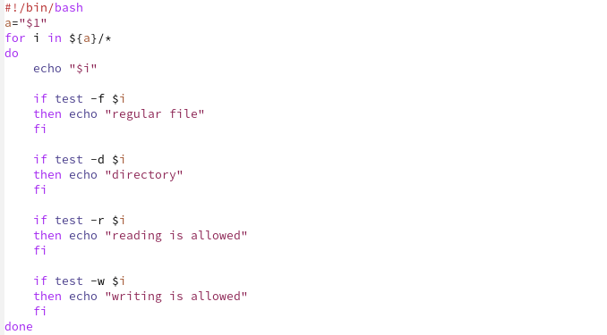{ #fig:012 width=70% }

10. Добавляю право на выполнение файла и проверяю его работу. (рис. [-@fig:013])

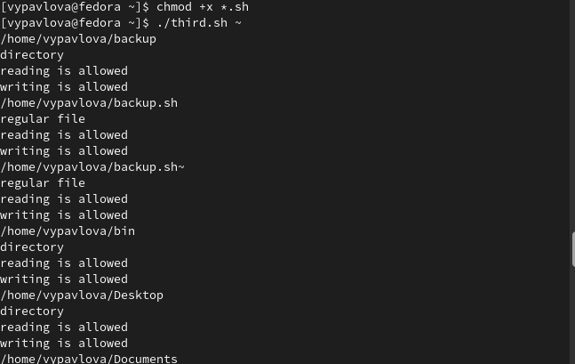{ #fig:013 width=70% }

11. Создаю четвертый исполняемый файл *fourth.sh* и открываю редактор *emacs*. (рис. [-@fig:014])

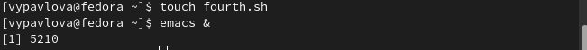{ #fig:014 width=70% }

12. Пишу командный файл, который получает в качестве аргумента командной строки формат файла (.txt, .doc, .jpg, .pdf и т.д.) и вычисляет количество таких файлов в указанной директории. Путь к директории также передаётся в виде аргумента командной строки. (рис. [-@fig:015])

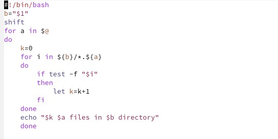{ #fig:015 width=70% }

13. Добавляю право на выполнение файла и проверяю его работу. (рис. [-@fig:016])

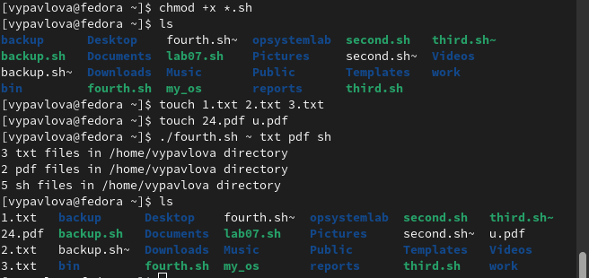{ #fig:016 width=70% }

# Выводы

Выполняя данную лабораторную работу я изучила основы программирования в оболочке ОС UNIX/Linux и научилась писать небольшие командные файлы.

# Список литературы{.unnumbered}

::: {#refs}
:::
