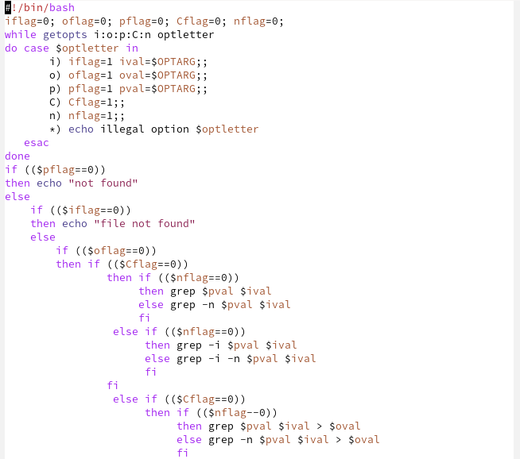
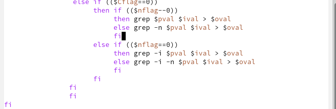
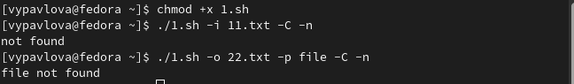
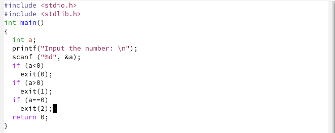
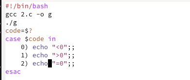
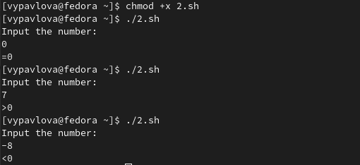
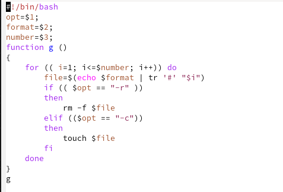
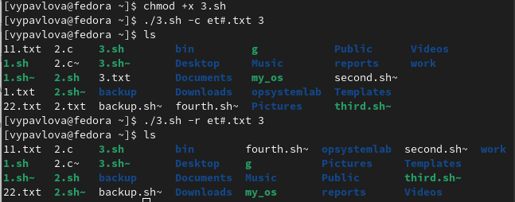
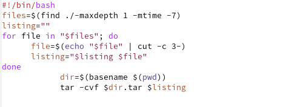
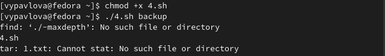

---
## Front matter
lang: ru-RU
title: Отчет по лабораторной работе №11
author: |
	Павлова Варвара Юрьевна НПМбд-02-21
institute: |
	Российский Университет Дружбы народов
date: Москва, 2022

## Formatting
toc: false
slide_level: 2
theme: metropolis
header-includes: 
  - '\makeatletter'
  - '\makeatother'
aspectratio: 43
section-titles: true
---

## Цель работы 

Изучить основы программирования в оболочке ОС UNIX. Научится писать более сложные командные файлы с использованием логических управляющих конструкций и циклов.

# Ход работы

# Первый скрипт

## Написание

Используя команды getopts grep, пишу командный файл, который анализирует командную строку с ключами:
- -iinputfile — прочитать данные из указанного файла;
- -ooutputfile — вывести данные в указанный файл;
- -pшаблон — указать шаблон для поиска;
- -C — различать большие и малые буквы;
- -n — выдавать номера строк.
а затем ищет в указанном файле нужные строки, определяемые ключом -p. (рис. [-@fig:001]) (рис. [-@fig:002])

{ #fig:001 width=70% }

{ #fig:002 width=70% }

## Проверка работы

Добавляю право на выполнение файла и проверяю его работу. (рис. [-@fig:003])

{ #fig:003 width=70% }

# Второй скрипт

## Написание

Пишу на языке Си программу, которая вводит число и определяет, является ли оно больше нуля, меньше нуля или равно нулю. Затем программа завершается с помощью функции exit(n), передавая информацию в о коде завершения в оболочку. (рис. [-@fig:004])

{ #fig:004 width=70% }

## Написание

Командный файл вызывает эту программу и, проанализировав с помощью команды $?, выдает сообщение о том, какое число было введено. (рис. [-@fig:005])

{ #fig:005 width=70% }

## Проверка работы

Добавляю право на выполнение файла и проверяю его работу. (рис. [-@fig:006])

{ #fig:006 width=70% }

# Третий скрипт

## Написание

Пишу командный файл, создающий указанное число файлов, пронумерованных последовательно от 1 до N (например 1.tmp, 2.tmp, 3.tmp,4.tmp и т.д.). Число файлов, которые необходимо создать, передаётся в аргументы командной строки. Этот же командный файл должен уметь удалять все созданные им файлы (если они существуют). (рис. [-@fig:007])

{ #fig:007 width=70% }

## Проверка работы

Добавляю право на выполнение файла и проверяю его работу. (рис. [-@fig:008])

{ #fig:008 width=70% }

# Четвертый скрипт

## Написание

Пишу командный файл, который с помощью команды tar запаковывает в архив все файлы в указанной директории. Модифицирую его так, чтобы запаковывались только те файлы, которые были изменены менее недели тому назад (использую команду find).  (рис. [-@fig:009])

{ #fig:009 width=70% }

## Проверка работы

Добавляю право на выполнение файла и проверяю его работу. (рис. [-@fig:009])

{ #fig:010 width=70% }

## Выводы

Выполняя данную лабораторную работу я изучила основы программирования в оболочке ОС UNIX/Linux и научилась писать небольшие командные файлы.

