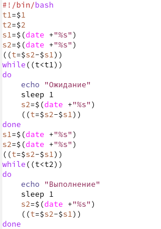
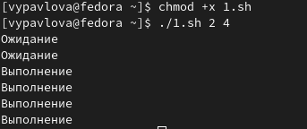
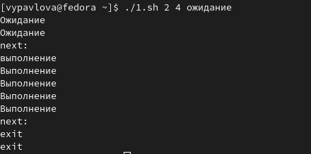
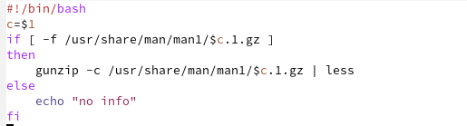
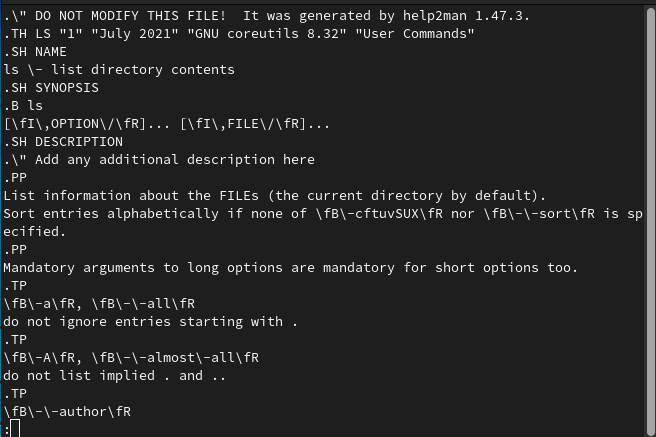
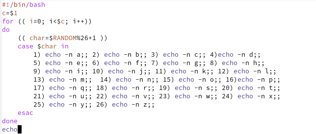
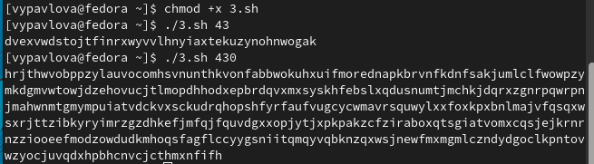

---
## Front matter
lang: ru-RU
title: Отчет по лабораторной работе №12
author: |
	Павлова Варвара Юрьевна НПМбд-02-21
institute: |
	Российский Университет Дружбы народов
date: Москва, 2022

## Formatting
toc: false
slide_level: 2
theme: metropolis
header-includes: 
  - '\makeatletter'
  - '\makeatother'
aspectratio: 43
section-titles: true
---

## Цель работы 

Изучить основы программирования в оболочке ОС UNIX. Научиться писать более сложные командные файлы с использованием логических управляющих конструкций и циклов.

# Ход работы

# Первый скрипт

## Написание

Пишу командный файл, реализующий упрощённый механизм семафоров. Командный файл должен в течение некоторого времени t1 дожидаться освобождения ресурса, выдавая об этом сообщение, а дождавшись его освобождения, использовать его в течение некоторого времени t2<>t1, также выдавая информацию о том, что ресурс используется соответствующим командным файлом (процессом). (рис. [-@fig:001]) 

{ #fig:001 width=70% }

## Проверка работы

Добавляю право на выполнение и проверяю работу файла. (рис. [-@fig:002])

{ #fig:002 width=70% }

## Проверка работы

Проверяю работу модифицированного файла. (рис. [-@fig:003])

{ #fig:003 width=70% }

# Второй скрипт

## Написание

Пишу командный файл, который должен получать в виде аргумента командной строки название команды и в виде результата выдавать справку об этой команде или сообщение об отсутствии справки, если соответствующего файла нет в каталоге man1.(рис. [-@fig:004])

{ #fig:004 width=70% }

## Проверка работы

Добавляю право на выполнение файла и проверяю его работу. (рис. [-@fig:005])

{ #fig:005 width=70% }

# Третий скрипт

## Написание

Используя встроенную переменную $RANDOM, пишу командный файл, генерирующий случайную последовательность букв латинского алфавита. (рис. [-@fig:006])

{ #fig:006 width=70% }

## Проверка работы

Добавляю право на выполнение файла и проверяю его работу. (рис. [-@fig:007])

{ #fig:007 width=70% }

## Выводы

Выполняя данную лабораторную работу я изучила основы программирования в оболочке ОС UNIX/Linux и научилась писать более сложные командные файлы с использованием логических управляющих конструкций и циклов.

