---
## Front matter
lang: ru-RU
title: Отчет по лабораторной работе №13
author: |
	Павлова Варвара Юрьевна НПМбд-02-21
institute: |
	Российский Университет Дружбы народов
date: Москва, 2022

## Formatting
toc: false
slide_level: 2
theme: metropolis
header-includes: 
  - '\makeatletter'
  - '\makeatother'
aspectratio: 43
section-titles: true
---

## Цель работы 

Приобрести простейшие навыки разработки, анализа, тестирования и отладки приложений в ОС типа UNIX/Linux на примере создания на языке программирования С калькулятора с простейшими функциями.

# Ход работы

## Создание каталога

В домашнем каталоге создаю подкаталог ~/work/os/lab_prog. (рис. [-@fig:001])

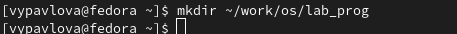{ #fig:001 width=70% }

# Написание калькулятора

## calculate.c

Пишу код для работы программы в файле calcelate.c. (рис. [-@fig:002]) (рис. [-@fig:003]) (рис. [-@fig:005]) (рис. [-@fig:006])

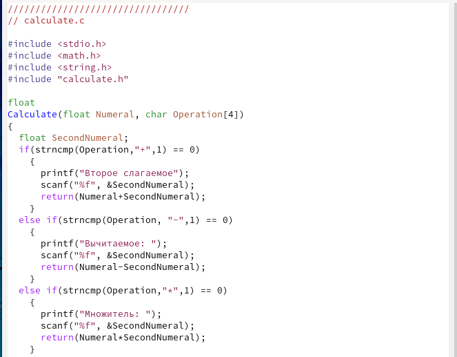{ #fig:002 width=70% }

## calculate.c

Пишу код для работы программы в файле calculate.c. (рис. [-@fig:003]) 

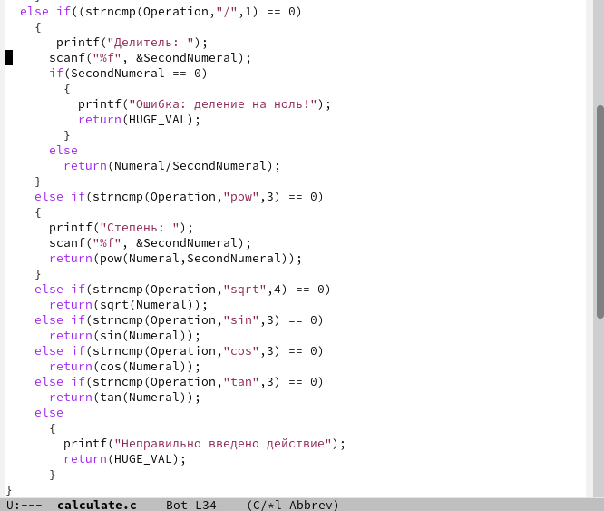{ #fig:003 width=70% }

## calculate.h

Пишу код для работы программы в файле calculate.h. (рис. [-@fig:004]) 

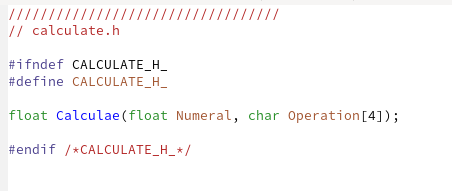{ #fig:004 width=70% }

## main.c

Пишу код для работы программы в файле main.c. (рис. [-@fig:005]) 

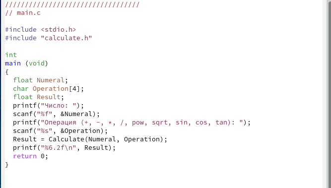{ #fig:005 width=70% }

## Компиляция

Выполняю компиляцию программы посредством gcc.(рис. [-@fig:006]) Ошибок не нашлось.

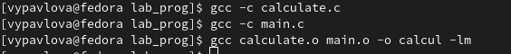{ #fig:006 width=70% }

# Makefile

## Написание

Создаю Makefile.  Пишу в файле текст, указанный в лабораторной работе. (рис. [-@fig:007]) 

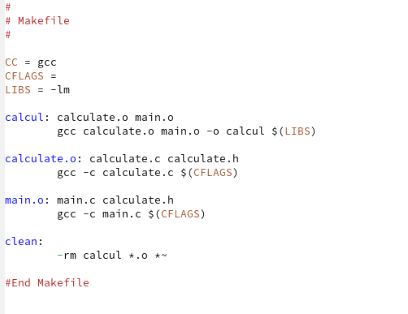{ #fig:007 width=70% } 

## Изменение

Меняю текст, чтобы я могла работать с отладчиком. (рис. [-@fig:008]) 

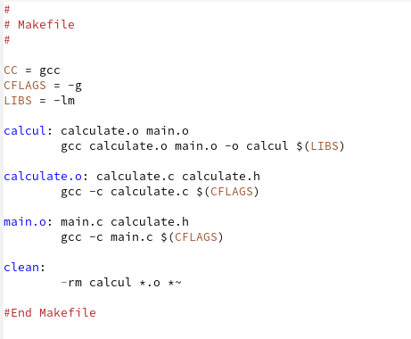{ #fig:008 width=70% }

## Запуск

Запускаю Makefile. (рис. [-@fig:009])

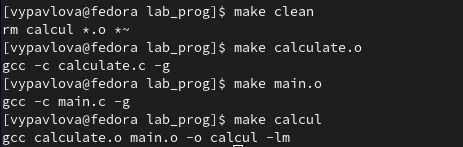{ #fig:009 width=70% }

# Отладчик GDB

## Запуск отладки

Запускаю отладчик GDB, загрузив в него программу для отладки. (рис. [-@fig:010])

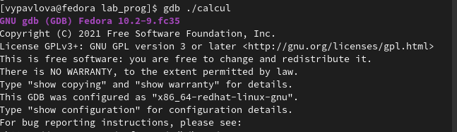{ #fig:010 width=70% }

## Запуск программы

Для запуска программы внутри отладчика ввожу команду run. (рис. [-@fig:011])

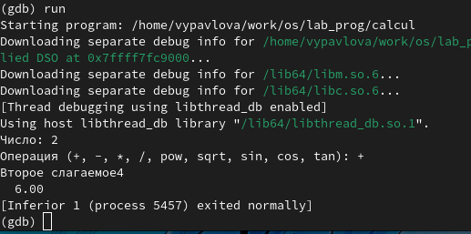{ #fig:011 width=70% }

## Постраничный просмотр

Постранично (по 9 строк) просматриваю исходный код. (рис. [-@fig:012])

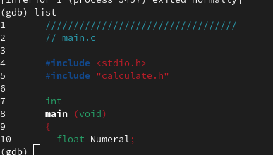{ #fig:012 width=70% }

## Просмотр строк

Для просмотра строк с 12 по 15 основного файла использую list с параметрами 12,15. (рис. [-@fig:013])

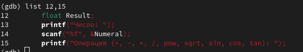{ #fig:013 width=70% }

## Просмотр строк

Для просмотра определённых строк не основного файла использую list с параметрами имя_файла: 20,29. (рис. [-@fig:014])

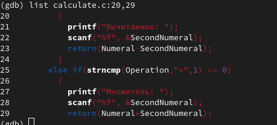{ #fig:014 width=70% }

## Установка точки остановки

Устанавливаю точку остановки в файле calculate.c на строке номер 21. (рис. [-@fig:015])

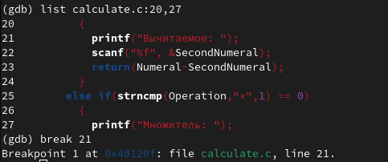{ #fig:015 width=70% }

## Информация о точках остановок

Вывожу информацию об имеющихся в проекте точках остановок. (рис. [-@fig:016])

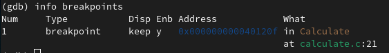{ #fig:016 width=70% }

## Запуск внутри отладчика

Запускаю программу внутри отладчика и убеждаюсь, что программа останавливается в момент прохождения точки остановки. (рис. [-@fig:017])

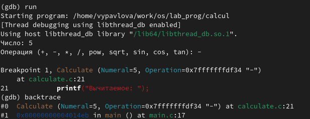{ #fig:017 width=70% }

## Сравнение значений

Посматриваю, чему равно на этом этапе значение переменной Numeral и сравниваю с результатом вывода на экран. (рис. [-@fig:018])

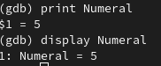{ #fig:018 width=70% }

## Удаление точек остановок

Убираю точки остановок.(рис. [-@fig:019])

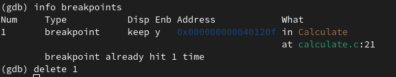{ #fig:019 width=70% }

## Анализ calculate.c

С помощью утилиты splint анализирую код файла calculate.c.(рис. [-@fig:020])

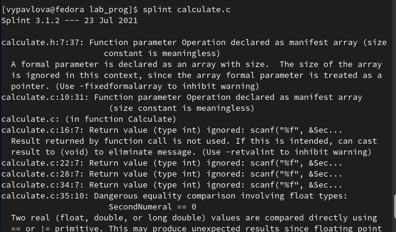{ #fig:020 width=70% }

## Анализ main.c

С помощью утилиты splint анализирую коды файлов main.c.(рис. [-@fig:021])

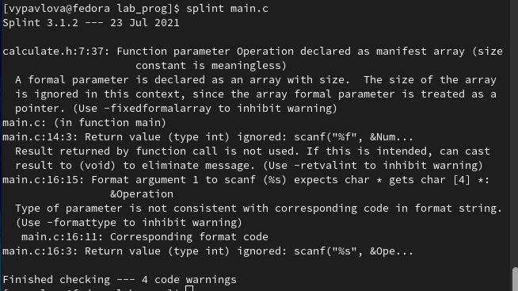{ #fig:021 width=70% }

## Выводы

Выполняя данную лабораторную работу я приобрела простейшие навыки разработки, анализа, тестирования и отладки приложений в ОС типа UNIX/Linux на примере создания на языке программирования С калькулятора с простейшими функциями.

