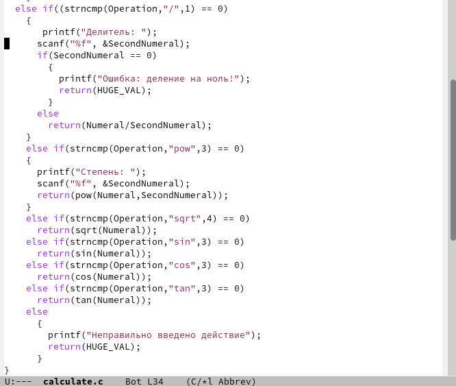
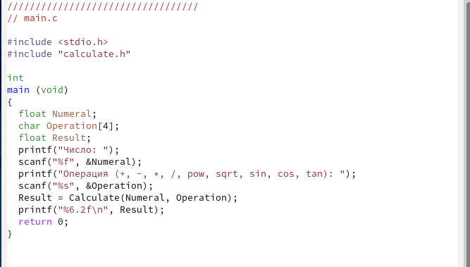

---
## Front matter
title: "Отчет"
subtitle: "Лабораторная работа №13"
author: "Павлова Варвара Юрьевна НПМбд-02-21"

## Generic otions
lang: ru-RU
toc-title: "Содержание"

## Bibliography
bibliography: bib/cite.bib
csl: pandoc/csl/gost-r-7-0-5-2008-numeric.csl

## Pdf output format
toc: true # Table of contents
toc-depth: 2
lof: true # List of figures
lot: true # List of tables
fontsize: 12pt
linestretch: 1.5
papersize: a4
documentclass: scrreprt
## I18n polyglossia
polyglossia-lang:
  name: russian
  options:
	- spelling=modern
	- babelshorthands=true
polyglossia-otherlangs:
  name: english
## I18n babel
babel-lang: russian
babel-otherlangs: english
## Fonts
mainfont: PT Serif
romanfont: PT Serif
sansfont: PT Sans
monofont: PT Mono
mainfontoptions: Ligatures=TeX
romanfontoptions: Ligatures=TeX
sansfontoptions: Ligatures=TeX,Scale=MatchLowercase
monofontoptions: Scale=MatchLowercase,Scale=0.9
## Biblatex
biblatex: true
biblio-style: "gost-numeric"
biblatexoptions:
  - parentracker=true
  - backend=biber
  - hyperref=auto
  - language=auto
  - autolang=other*
  - citestyle=gost-numeric
## Pandoc-crossref LaTeX customization
figureTitle: "Рис."
listingTitle: "Листинг"
lofTitle: "Список иллюстраций"
lolTitle: "Листинги"
## Misc options
indent: true
header-includes:
  - \usepackage{indentfirst}
  - \usepackage{float} # keep figures where there are in the text
  - \floatplacement{figure}{H} # keep figures where there are in the text
---

# Цель работы

Приобрести простейшие навыки разработки, анализа, тестирования и отладки приложений в ОС типа UNIX/Linux на примере создания на языке программирования С калькулятора с простейшими функциями.

# Задание

1. В домашнем каталоге создайте подкаталог ~/work/os/lab_prog.
2. Создайте в нём файлы: calculate.h, calculate.c, main.c.
Это будет примитивнейший калькулятор, способный складывать, вычитать, умножать и делить, возводить число в степень, брать квадратный корень, вычислять sin, cos, tan. При запуске он будет запрашивать первое число, операцию, второе число. После этого программа выведет результат и остановится.
3. Выполните компиляцию программы посредством gcc.
4. При необходимости исправьте синтаксические ошибки.
5. Создайте Makefile.
6. С помощью gdb выполните отладку программы calcul (перед использованием gdb
исправьте Makefile):
Запустите отладчик GDB, загрузив в него программу для отладки.
- Для запуска программы внутри отладчика введите команду run.
- Постранично (по 9 строк) просмотрите исходный код.
- Для просмотра строк с 12 по 15 основного файла используйте list с параметрами.
- Для просмотра определённых строк не основного файла используйте list с параметрами.
- Установите точку остановки в файле calculate.c на строке номер 21.
- Выведите информацию об имеющихся в проекте точках остановок.
- Запустите программу внутри отладчика и убедитесь, что программа остановится в момент прохождения точки остановки.
- Посмотрите, чему равно на этом этапе значение переменной Numeral.
- Сравните с результатом вывода на экран.
- Уберите точки остановок.
7. С помощью утилиты splint попробуйте проанализировать коды файлов calculate.c
и main.c.

# Теоретическое введение

Процесс разработки программного обеспечения обычно разделяется на следующие этапы:
- планирование, включающее сбор и анализ требований к функционалу и другим характеристикам разрабатываемого приложения;
- проектирование, включающее в себя разработку базовых алгоритмов и спецификаций, определение языка программирования;
- непосредственная разработка приложения:
- кодирование — по сути создание исходного текста программы (возможно в нескольких вариантах);
- анализ разработанного кода;
- сборка, компиляция и разработка исполняемого модуля;
- тестирование и отладка, сохранение произведённых изменений;
- документирование.
Для создания исходного текста программы разработчик может воспользоваться любым
удобным для него редактором текста: vi, vim, mceditor, emacs, geany и др. 
После завершения написания исходного кода программы (возможно состоящей из нескольких файлов), необходимо её скомпилировать и получить исполняемый модуль.

# Выполнение лабораторной работы

1. В домашнем каталоге создаю подкаталог ~/work/os/lab_prog. (рис. [-@fig:001])

{ #fig:001 width=70% }

2. Создаю в нём файлы: *calculate.h*, *calculate.c*, *main.c*. (рис. [-@fig:002]) Пишу код для работы программы в созданных файлах. (рис. [-@fig:003]) (рис. [-@fig:004]) (рис. [-@fig:005]) (рис. [-@fig:006])

{ #fig:002 width=70% }

{ #fig:003 width=70% }

{ #fig:004 width=70% }

{ #fig:005 width=70% }

{ #fig:006 width=70% }

3. Выполняю компиляцию программы посредством gcc.(рис. [-@fig:007]) Ошибок не нашлось.

{ #fig:007 width=70% }

4. Создаю Makefile. (рис. [-@fig:008]) Пишу в файле текст, указанный в лабораторной работе. (рис. [-@fig:009]) Меняю текст, чтобы я могла работать с отладчиком. (рис. [-@fig:010]) Запускаю Makefile. (рис. [-@fig:011])

{ #fig:008 width=70% }

{ #fig:009 width=70% } 

{ #fig:010 width=70% }

{ #fig:011 width=70% }

6. С помощью gdb выполняю отладку программы calcul:
Запускаю отладчик GDB, загрузив в него программу для отладки. (рис. [-@fig:012])
- Для запуска программы внутри отладчика ввожу команду run. (рис. [-@fig:013])
- Постранично (по 9 строк) просматриваю исходный код. (рис. [-@fig:014])
- Для просмотра строк с 12 по 15 основного файла использую list с параметрами 12,15. (рис. [-@fig:015])
- Для просмотра определённых строк не основного файла использую list с параметрами имя_файла: 20,29. (рис. [-@fig:016])
- Устанавливаю точку остановки в файле calculate.c на строке номер 21. (рис. [-@fig:017])
- Вывожу информацию об имеющихся в проекте точках остановок. (рис. [-@fig:018])
- Запускаю программу внутри отладчика и убеждаюсь, что программа останавливается в момент прохождения точки остановки. (рис. [-@fig:019])
- Посматриваю, чему равно на этом этапе значение переменной Numeral и сравниваю с результатом вывода на экран. (рис. [-@fig:020])
- Убираю точки остановок.(рис. [-@fig:021])

{ #fig:012 width=70% }

{ #fig:013 width=70% }

{ #fig:014 width=70% }

{ #fig:015 width=70% }

{ #fig:016 width=70% }

{ #fig:017 width=70% }

{ #fig:018 width=70% }

{ #fig:019 width=70% }

{ #fig:020 width=70% }

{ #fig:021 width=70% }

7. С помощью утилиты splint анализирую коды файлов calculate.c и main.c.(рис. [-@fig:022])(рис. [-@fig:023])

{ #fig:022 width=70% }

{ #fig:023 width=70% }

# Выводы

Выполняя данную лабораторную работу я приобрела простейшие навыки разработки, анализа, тестирования и отладки приложений в ОС типа UNIX/Linux на примере создания на языке программирования С калькулятора с простейшими функциями.

# Список литературы{.unnumbered}

::: {#refs}
:::
