---
## Front matter
lang: ru-RU
title: Отчет по лабораторной работе №14
author: |
	Павлова Варвара Юрьевна НПМбд-02-21
institute: |
	Российский Университет Дружбы народов
date: Москва, 2022

## Formatting
toc: false
slide_level: 2
theme: metropolis
header-includes: 
  - '\makeatletter'
  - '\makeatother'
aspectratio: 43
section-titles: true
---

## Цель работы 

Приобретение практических навыков работы с именованными каналами.

# Ход работы

## Создание файлов

Создаю необходимые файлы с помощью команды *touch*.(рис. [-@fig:001])

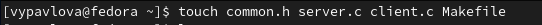{ #fig:001 width=70% }

# Написание кода

## common.h

В файл *common.h* добавляю стандартные заголовочные файлы *time.h* и *unistd.h* (рис. [-@fig:002]) 

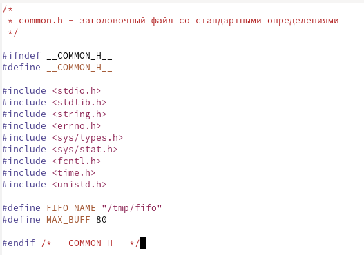{ #fig:002 width=70% }

## server.c

В файл *server.c* добавляю цикл while для контроля за временем работы сервера. Разница между текущим временем и временем начала работы не должна превышать 30 секунд. (рис. [-@fig:003])

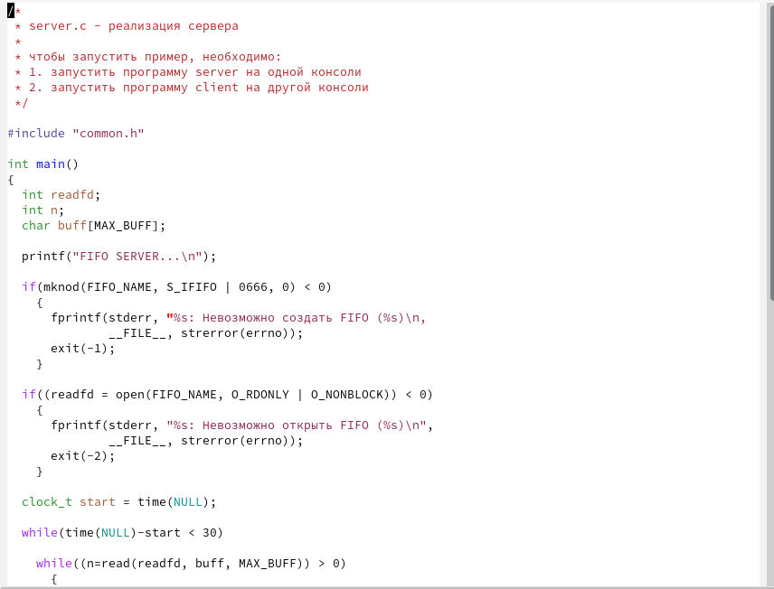{ #fig:003 width=70% }

## server.c

В файл *server.c* добавляю цикл while для контроля за временем работы сервера. Разница между текущим временем и временем начала работы не должна превышать 30 секунд. (рис. [-@fig:004]) 

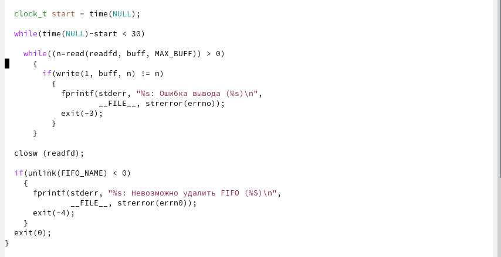{ #fig:004 width=70% }

## client.c

В файл *client.c* добавляю цикл, который отвечает за количество сообщений о текущем времени и команду sleep(5) для приостановки работы клиента на 5 секунд. (рис. [-@fig:005])

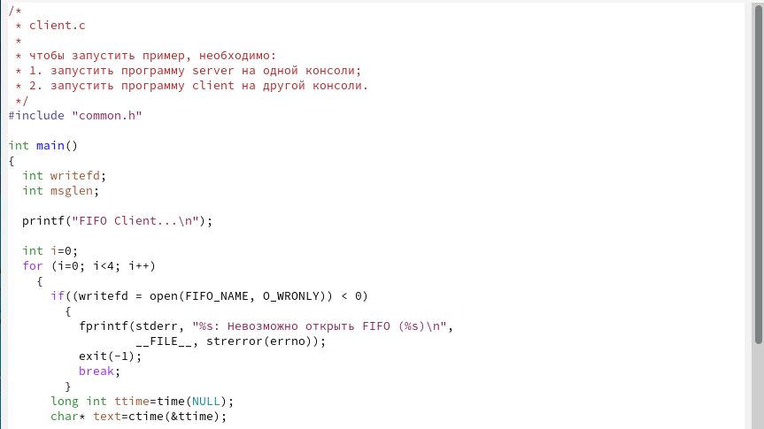{ #fig:005 width=70% }

## client.c

В файл *client.c* добавляю цикл, который отвечает за количество сообщений о текущем времени и команду sleep(5) для приостановки работы клиента на 5 секунд. (рис. [-@fig:006])

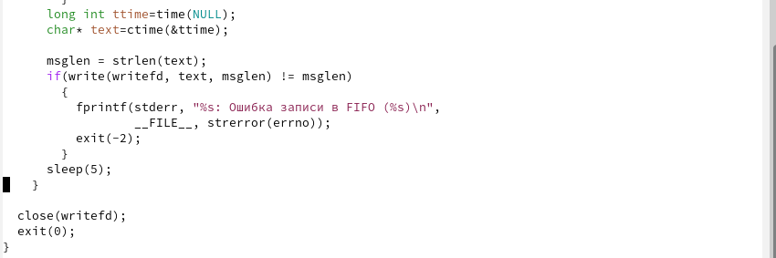{ #fig:006 width=70% }

## Makefile

Файл для сборки - Makefile - не изменяю. (рис. [-@fig:007])

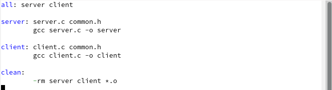{ #fig:007 width=70% }

## Компиляция

Выполяню команду make all и компилирую необходимые файлы. (рис. [-@fig:008]) 

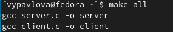{ #fig:008 width=70% }

## Проверка работы

Проверяю работу написанного кода. Открываю 3 консоли и запускаю в одном из них *./server*(рис. [-@fig:009]), а в двух других - *./client*. (рис. [-@fig:010]) (рис. [-@fig:011])

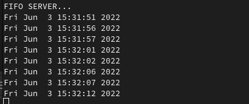{ #fig:009 width=70% } 

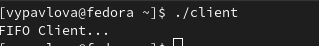{ #fig:010 width=70% }

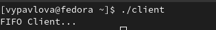{ #fig:011 width=70% }

## Выводы

Выполняя данную лабораторную работу я приобрела практические навыки работы с именованными каналами.

