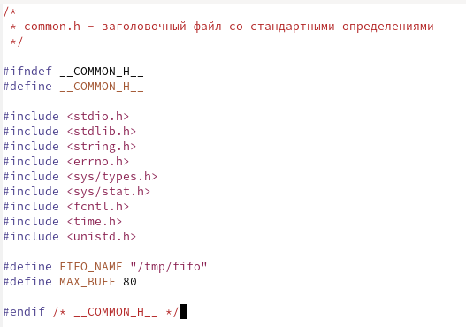
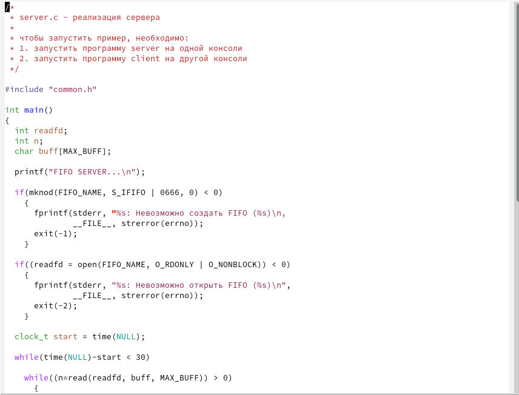
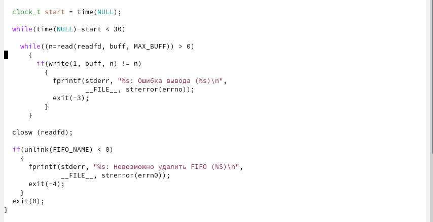
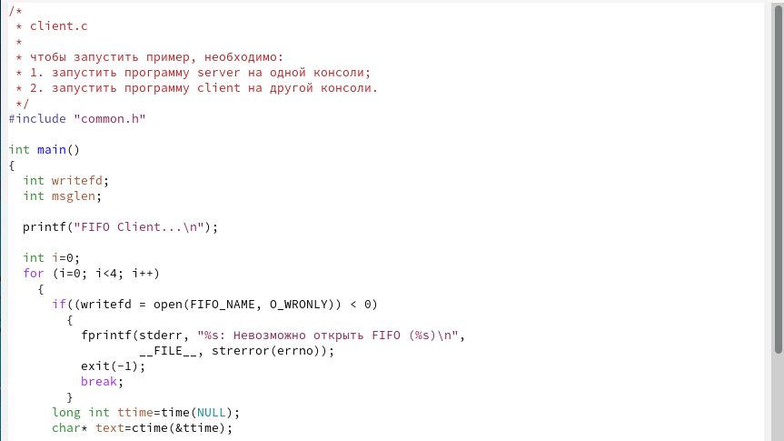
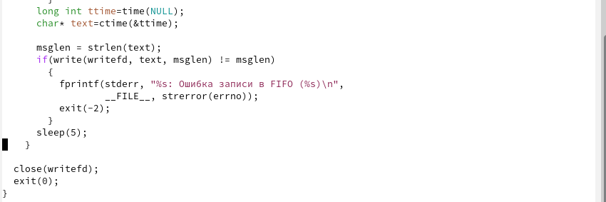
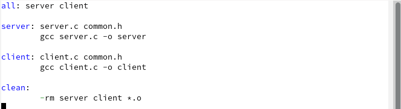
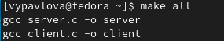
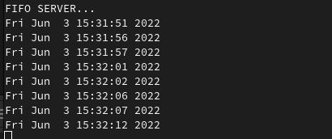
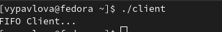
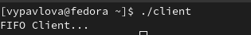

---
## Front matter
title: "Отчет"
subtitle: "Лабораторная работа №14"
author: "Павлова Варвара Юрьевна НПМбд-02-21"

## Generic otions
lang: ru-RU
toc-title: "Содержание"

## Bibliography
bibliography: bib/cite.bib
csl: pandoc/csl/gost-r-7-0-5-2008-numeric.csl

## Pdf output format
toc: true # Table of contents
toc-depth: 2
lof: true # List of figures
lot: true # List of tables
fontsize: 12pt
linestretch: 1.5
papersize: a4
documentclass: scrreprt
## I18n polyglossia
polyglossia-lang:
  name: russian
  options:
	- spelling=modern
	- babelshorthands=true
polyglossia-otherlangs:
  name: english
## I18n babel
babel-lang: russian
babel-otherlangs: english
## Fonts
mainfont: PT Serif
romanfont: PT Serif
sansfont: PT Sans
monofont: PT Mono
mainfontoptions: Ligatures=TeX
romanfontoptions: Ligatures=TeX
sansfontoptions: Ligatures=TeX,Scale=MatchLowercase
monofontoptions: Scale=MatchLowercase,Scale=0.9
## Biblatex
biblatex: true
biblio-style: "gost-numeric"
biblatexoptions:
  - parentracker=true
  - backend=biber
  - hyperref=auto
  - language=auto
  - autolang=other*
  - citestyle=gost-numeric
## Pandoc-crossref LaTeX customization
figureTitle: "Рис."
listingTitle: "Листинг"
lofTitle: "Список иллюстраций"
lolTitle: "Листинги"
## Misc options
indent: true
header-includes:
  - \usepackage{indentfirst}
  - \usepackage{float} # keep figures where there are in the text
  - \floatplacement{figure}{H} # keep figures where there are in the text
---

# Цель работы

Приобретение практических навыков работы с именованными каналами.

# Задание

Изучите приведённые в тексте программы server.c и client.c. Взяв данные примеры за образец, напишите аналогичные программы, внеся следующие изменения:
1. Работает не 1 клиент, а несколько (например, два).
2. Клиенты передают текущее время с некоторой периодичностью (например, раз в пять секунд). Используйте функцию sleep() для приостановки работы клиента.
3. Сервер работает не бесконечно, а прекращает работу через некоторое время (напри-
мер, 30 сек). Используйте функцию clock() для определения времени работы сервера. Что будет в случае, если сервер завершит работу, не закрыв канал?

# Теоретическое введение

Одним из видов взаимодействия между процессами в операционных системах является обмен сообщениями. Под сообщением понимается последовательность байтов, передаваемая от одного процесса другому.
В операционных системах типа UNIX есть 3 вида межпроцессорных взаимодействий: общеюниксные (именованные каналы, сигналы), System V Interface Definition (SVID — разделяемая память, очередь сообщений, семафоры) и BSD (сокеты).
Для передачи данных между неродственными процессами можно использовать механизм именованных каналов (named pipes). Данные передаются по принципу FIFO (First In First Out) (первым записан — первым прочитан), поэтому они называются также FIFO pipes или просто FIFO. Именованные каналы отличаются от неименованных наличием идентификатора канала, который представлен как специальный файл (соответственно имя именованного канала — это имя файла). Поскольку файл находится на локальной файловой системе, данное IPC используется внутри одной системы.

# Выполнение лабораторной работы

1. Создаю необходимые файлы с помощью команды *touch*.(рис. [-@fig:001])

{ #fig:001 width=70% }

2. В файл *common.h* добавляю стандартные заголовочные файлы *time.h* и *unistd.h* (рис. [-@fig:002]) 

{ #fig:002 width=70% }

3. В файл *server.c* добавляю цикл while для контроля за временем работы сервера. Разница между текущим временем и временем начала работы не должна превышать 30 секунд. (рис. [-@fig:003]) (рис. [-@fig:004]) 

{ #fig:003 width=70% }

{ #fig:004 width=70% }

4. В файл *client.c* добавляю цикл, который отвечает за количество сообщений о текущем времени и команду sleep(5) для приостановки работы клиента на 5 секунд. (рис. [-@fig:005]) (рис. [-@fig:006])

{ #fig:005 width=70% }

{ #fig:006 width=70% }

3. Файл для сборки - Makefile - не изменяю. (рис. [-@fig:007])

{ #fig:007 width=70% }

4. Выполяню команду make all и компилирую необходимые файлы. (рис. [-@fig:008]) 

{ #fig:008 width=70% }

5. Проверяю работу написанного кода. Открываю 3 консоли и запускаю в одном из них *./server*(рис. [-@fig:009]) , а в двух других - *./client*. (рис. [-@fig:010]) (рис. [-@fig:011])

{ #fig:009 width=70% } 

{ #fig:010 width=70% }

{ #fig:011 width=70% }

6. Если сервер завершит работу, не закрыв канал, то при следующей попытке запуска будет выдана ошибка "Невозможно создать FIFO".

# Выводы

Выполняя данную лабораторную работу я приобрела практические навыки работы с именованными каналами.

# Список литературы{.unnumbered}

::: {#refs}
:::
