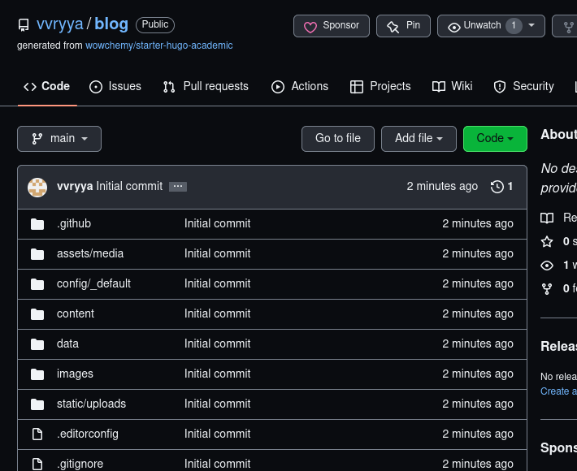
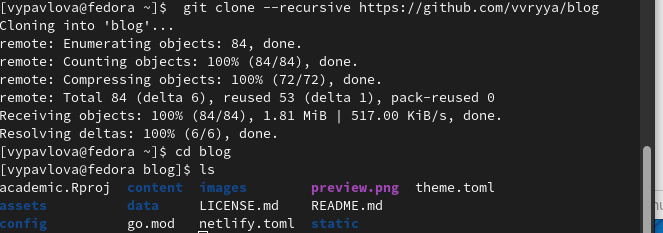
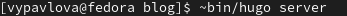
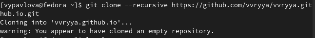
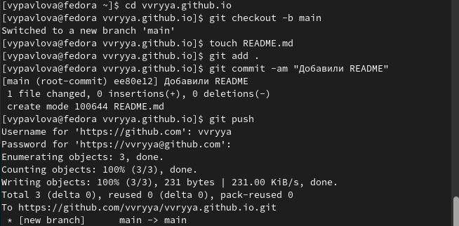
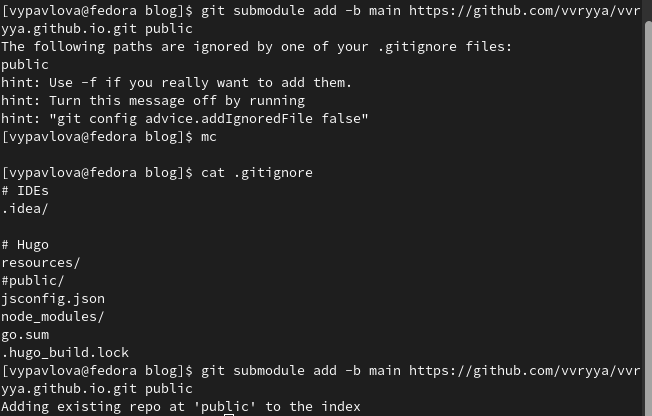
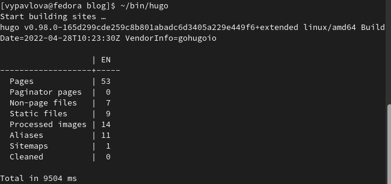

---
## Front matter
title: "Персональный проект"
subtitle: "Первый этап"
author: "Павлова Варвара Юрьевна НПМбд-02-21 1032217616"

## Generic otions
lang: ru-RU
toc-title: "Содержание"

## Bibliography
bibliography: bib/cite.bib
csl: pandoc/csl/gost-r-7-0-5-2008-numeric.csl

## Pdf output format
toc: true # Table of contents
toc-depth: 2
lof: true # List of figures
lot: true # List of tables
fontsize: 12pt
linestretch: 1.5
papersize: a4
documentclass: scrreprt
## I18n polyglossia
polyglossia-lang:
  name: russian
  options:
	- spelling=modern
	- babelshorthands=true
polyglossia-otherlangs:
  name: english
## I18n babel
babel-lang: russian
babel-otherlangs: english
## Fonts
mainfont: PT Serif
romanfont: PT Serif
sansfont: PT Sans
monofont: PT Mono
mainfontoptions: Ligatures=TeX
romanfontoptions: Ligatures=TeX
sansfontoptions: Ligatures=TeX,Scale=MatchLowercase
monofontoptions: Scale=MatchLowercase,Scale=0.9
## Biblatex
biblatex: true
biblio-style: "gost-numeric"
biblatexoptions:
  - parentracker=true
  - backend=biber
  - hyperref=auto
  - language=auto
  - autolang=other*
  - citestyle=gost-numeric
## Pandoc-crossref LaTeX customization
figureTitle: "Рис."
tableTitle: "Таблица"
listingTitle: "Листинг"
lofTitle: "Список иллюстраций"
lotTitle: "Список таблиц"
lolTitle: "Листинги"
## Misc options
indent: true
header-includes:
  - \usepackage{indentfirst}
  - \usepackage{float} # keep figures where there are in the text
  - \floatplacement{figure}{H} # keep figures where there are in the text
---

# Цель работы

Создание сайта.

# Задание

Разместить на github шаблон создаваемого сайта.

# Выполнение лабораторной работы

1. Клонирую репозиторий blog (рис. [-@fig:001]) в домашнюю папку. (рис. [-@fig:002])

{ #fig:001 width=70% }

{ #fig:002 width=70% }

2. Скачав hugo, перехожу в папку blog и на ее основе выполняю команду *~/bin/hugo server*. (рис. [-@fig:003])

{ #fig:003 width=70% }
 
3. Создаю репозиторий, на который потом буду загружать шаблоны сайта, и клонирую его. (рис. [-@fig:004])

{ #fig:004 width=70% }

4. Перехожу в папку репозитория, добавляю ветку main и создаю первый коммит. (рис. [-@fig:005])

{ #fig:005 width=70% }
 
 5. Привязываю репозиторий к папке blog, получаю ошибку. Исправляю настройки в .gitignore и пробую еще раз.(рис. [-@fig:006])

{ #fig:006 width=70% }
 
 6. Использую команду *~/bin/hugo* для активации сайта (рис. [-@fig:007]) и получаю его, скопировав название репозитория и перейдя по нему, как по ссылке. (рис. [-@fig:008])

{ #fig:007 width=70% }
 

{ #fig:008 width=70% }
 
 
# Выводы

Во время выполнения первого этапа я узнала о том, как начинать делать сайт по шаблону.

# Список литературы{.unnumbered}

::: {#refs}
:::
