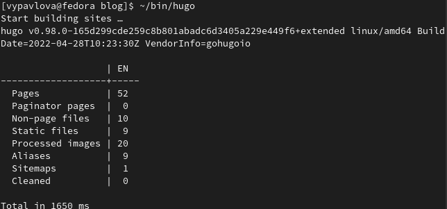

---
## Front matter
lang: ru-RU
title: Отчет по выполнению 3 этапа
author: |
	Павлова Варвара Юрьевна НПМбд-02-21
institute: |
	Российский Университет Дружбы народов
date: Москва, 2022

## Formatting
toc: false
slide_level: 2
theme: metropolis
header-includes: 
  - '\makeatletter'
  - '\makeatother'
aspectratio: 43
section-titles: true
---

## Цель работы 

Создание академического сайта.

# Ход работы

## Открытие локальной версии сайта

Вызываю ~/bin/hugo server и перехожу на сайт.(рис. [-@fig:001])

{ #fig:001 width=70% }

## Опыт

Вношу изменения в раздел об опыте.(рис. [-@fig:002]) 

{ #fig:002 width=70% }

## Достижения

Вношу изменения в раздел о достижениях.(рис. [-@fig:003])

{ #fig:003 width=70% }

## Навыки

Вношу изменения в раздел о навыках.(рис. [-@fig:004])

{ #fig:004 width=70% }

## Написание постов

Создаю пост по прошедшей неделе в папке 3 этап и пост о языке разметки Markdown в папке markdown.(рис. [-@fig:005])

{ #fig:005 width=70% }

## Вызов hugo

Вызываю в терминале ~/bin/hugo и отправляю изменения на github.(рис. [-@fig:006])

{ #fig:006 width=70% }

# Проверка изменений

## Навыки

(рис. [-@fig:007])

{ #fig:007 width=70% }

## Опыт

(рис. [-@fig:008])

{ #fig:008 width=70% }

## Достижения

(рис. [-@fig:009])

{ #fig:009 width=70% }

## Посты

(рис. [-@fig:010])

{ #fig:010 width=70% }

## Выводы

Выполняя данный этап я научилась публиковать данные на сайте.

