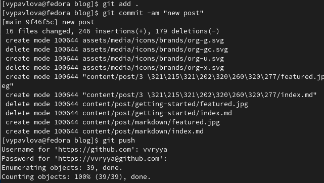

---
## Front matter
title: "Отчет"
subtitle: "3 этап"
author: "Павлова Варвара Юрьевна НПМбд-02-21"

## Generic otions
lang: ru-RU
toc-title: "Содержание"

## Bibliography
bibliography: bib/cite.bib
csl: pandoc/csl/gost-r-7-0-5-2008-numeric.csl

## Pdf output format
toc: true # Table of contents
toc-depth: 2
lof: true # List of figures
lot: true # List of tables
fontsize: 12pt
linestretch: 1.5
papersize: a4
documentclass: scrreprt
## I18n polyglossia
polyglossia-lang:
  name: russian
  options:
	- spelling=modern
	- babelshorthands=true
polyglossia-otherlangs:
  name: english
## I18n babel
babel-lang: russian
babel-otherlangs: english
## Fonts
mainfont: PT Serif
romanfont: PT Serif
sansfont: PT Sans
monofont: PT Mono
mainfontoptions: Ligatures=TeX
romanfontoptions: Ligatures=TeX
sansfontoptions: Ligatures=TeX,Scale=MatchLowercase
monofontoptions: Scale=MatchLowercase,Scale=0.9
## Biblatex
biblatex: true
biblio-style: "gost-numeric"
biblatexoptions:
  - parentracker=true
  - backend=biber
  - hyperref=auto
  - language=auto
  - autolang=other*
  - citestyle=gost-numeric
## Pandoc-crossref LaTeX customization
figureTitle: "Рис."
tableTitle: "Таблица"
listingTitle: "Листинг"
lofTitle: "Список иллюстраций"
lotTitle: "Список таблиц"
lolTitle: "Листинги"
## Misc options
indent: true
header-includes:
  - \usepackage{indentfirst}
  - \usepackage{float} # keep figures where there are in the text
  - \floatplacement{figure}{H} # keep figures where there are in the text
---

# Цель работы

Создание академического сайта.

# Задание

**Добавить к сайту достижения.**
- *Список достижений*
   - Добавить информацию о навыках (Skills).
   - Добавить информацию об опыте (Experience).
   - Добавить информацию о достижениях (Accomplishments).
*Сделать пост по прошедшей неделе.*
*Добавить пост на тему по выбору:*
   - Легковесные языки разметки.
   - Языки разметки. LaTeX.
   - Язык разметки Markdown.

# Выполнение 3 этапа

1. Вызываю ~/bin/hugo server и перехожу на сайт.(рис. [-@fig:001])

{ #fig:001 width=70% }

2. Вношу изменения в раздел об опыте.(рис. [-@fig:002]) 

{ #fig:002 width=70% }

3. Вношу изменения в раздел о достижениях.(рис. [-@fig:003])

{ #fig:003 width=70% }

4. Вношу изменения в раздел о навыках.(рис. [-@fig:004])

{ #fig:004 width=70% }

5. Создаю пост по прошедшей неделе в папке 3 этап и пост о языке разметки Markdown в папке markdown.(рис. [-@fig:005])

{ #fig:005 width=70% }

6. Вызываю в терминале ~/bin/hugo.(рис. [-@fig:006])

{ #fig:006 width=70% }

7. Перехожу в подкаталог public и выполняю команды *git add .*, *git commit* и *git push*.(рис. [-@fig:007])

{ #fig:007 width=70% }

8. Перехожу в каталог blog и выполняю команды *git add .*, *git commit* и *git push*.(рис. [-@fig:008])

{ #fig:008 width=70% }

9. Захожу на сайт и проверяю изменения.(рис. [-@fig:009])(рис. [-@fig:010])(рис. [-@fig:011])(рис. [-@fig:012])

{ #fig:009 width=70% }

{ #fig:010 width=70% }

{ #fig:011 width=70% }

{ #fig:012 width=70% }

# Выводы

Выполняя данный этап я научилась публиковать данные на сайте.

