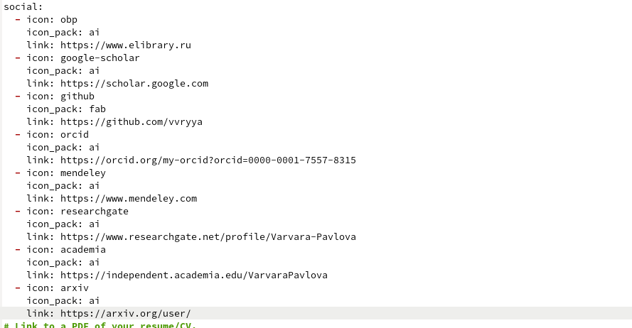
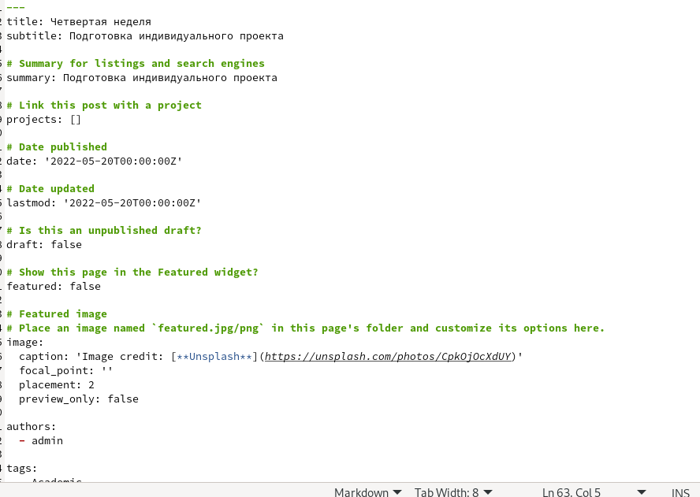
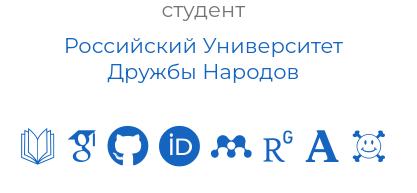

---
## Front matter
lang: ru-RU
title: Отчет по выполнению 4 этапа
author: |
	Павлова Варвара Юрьевна НПМбд-02-21
institute: |
	Российский Университет Дружбы народов
date: Москва, 2022

## Formatting
toc: false
slide_level: 2
theme: metropolis
header-includes: 
  - '\makeatletter'
  - '\makeatother'
aspectratio: 43
section-titles: true
---

## Цель работы 

Создание академического сайта.

# Ход работы

## Открытие локальной версии сайта

Вызываю ~/bin/hugo server и перехожу на сайт.(рис. [-@fig:001])

{ #fig:001 width=70% }

## Размещение ссылок

Регистрируюсь на указанных в задании ресурсах и оставляю на них ссылку на сайте. (рис. [-@fig:002]) 

{ #fig:002 width=70% }

## Написание постов

Пишу пост на тему оформления отчета. (рис. [-@fig:003])

{ #fig:003 width=70% }

## Написание постов

Пишу пост о прошедшей неделе. (рис. [-@fig:004])

{ #fig:004 width=70% }

## Вызов hugo

Вызываю в терминале ~/bin/hugo и отправляю изменения на github.(рис. [-@fig:005])

{ #fig:005 width=70% }

# Проверка изменений

## Ссылки

(рис. [-@fig:006])

{ #fig:006 width=70% }

## Посты

(рис. [-@fig:007])

{ #fig:007 width=70% }

## Выводы

Выполняя данный этап я научилась публиковать данные на сайте.

